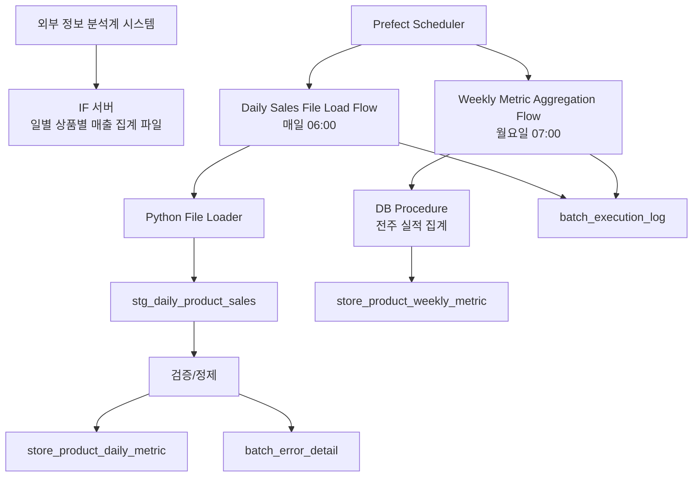

# POG 실적 인터페이스 및 배치 설계서

## 1. 목적

본 문서는 외부 정보 분석계 시스템에서 생성한 일별 상품별 매출 집계 자료를 IF 서버를 통해 수신하고, POG 시스템 DB에 적재한 뒤 주간 집계 테이블을 생성하는 배치 아키텍처를 정의한다.

POG 시스템의 스코어링, 표준진열제안, 점별진열대장 생성, 시즌 POG 제안은 주별 또는 월별 집계 자료를 기준으로 수행한다. 따라서 일별 실적 파일의 안정적인 수신, 검증, 적재, 주간 집계 누적은 전체 POG 품질의 기준 데이터가 된다.

## 2. 기본 전제

| 항목 | 기준 |
|---|---|
| 원천 시스템 | 외부 정보 분석계 시스템 |
| 파일 전달 위치 | IF 서버 |
| 원천 파일 도착 기준 | 매일 04:00까지 |
| POG 일 배치 실행 | 매일 06:00 |
| POG 주 배치 실행 | 매주 월요일 07:00 |
| 배치 관리 도구 | Prefect |
| 파일 처리 구현 | Python |
| 주간 집계 구현 | DB Stored Procedure |
| 집계 단위 | 점포, 상품, 일자 및 주차 |
| 적재 원장 | PostgreSQL |

외부 정보 분석계 시스템은 전일 마감 기준 일별 상품별 매출 집계 자료를 생성하여 매일 04:00까지 IF 서버에 파일로 업로드한다. POG 배치 프로그램은 매일 06:00에 해당 파일을 읽어 DB에 적재한다. 매주 월요일 07:00에는 전주 실적을 DB 프로시저로 집계하여 주간 집계 테이블에 누적한다.

## 3. 전체 아키텍처



## 4. 배치 구성

### 4.1 Prefect Flow

| Flow | 실행 시간 | 역할 |
|---|---|---|
| `daily_sales_file_load_flow` | 매일 06:00 | IF 서버 파일 확인, 다운로드 또는 읽기, staging 적재, 검증, 일별 확정 테이블 upsert |
| `weekly_metric_aggregation_flow` | 매주 월요일 07:00 | 전주 기간 산정, 주간 집계 프로시저 실행, 주간 집계 테이블 누적 |
| `file_arrival_check_flow` | 선택, 04:10~06:00 사이 | 파일 도착 여부 사전 확인 및 지연 알림 |
| `batch_reprocess_flow` | 수동 | 특정 영업일 또는 특정 주차 재처리 |

### 4.2 Python 처리 범위

Python 프로그램은 파일 처리와 staging 적재를 담당한다.

| 처리 | 설명 |
|---|---|
| 파일 존재 확인 | IF 서버 지정 경로에서 기준일 파일 확인 |
| 파일명 검증 | 업무일자, 파일 유형, 생성 시각, 확장자 확인 |
| 파일 무결성 검증 | 파일 크기, row count, checksum 또는 trailer 정보 확인 |
| 스키마 검증 | 필수 컬럼, 숫자 타입, 날짜 형식, 코드 형식 확인 |
| staging 적재 | 원천 row를 staging 테이블에 bulk insert |
| 오류 분리 | 필수값 누락, 숫자 변환 오류, 마스터 미존재 등 오류 row 저장 |
| 확정 반영 | 검증 성공 row를 일별 확정 테이블에 upsert |
| 파일 보관 | 성공/실패/중복 파일을 archive 또는 error 경로로 이동 |

주간 집계는 Python에서 직접 계산하지 않고 DB 프로시저를 실행한다. 집계 기준과 재현성을 DB에 집중시키기 위함이다.

## 5. 파일 수신 설계

### 5.1 IF 서버 디렉터리

```text
/if/pog/inbound/daily_sales/
/if/pog/archive/daily_sales/
/if/pog/error/daily_sales/
/if/pog/working/daily_sales/
```

### 5.2 파일명 규칙

```text
POG_DAILY_PRODUCT_SALES_YYYYMMDD_YYYYMMDDHHMISS.csv
```

예시:

```text
POG_DAILY_PRODUCT_SALES_20260905_20260906035500.csv
```

첫 번째 일자는 실적 기준일이고, 두 번째 일자는 파일 생성 시각이다.

### 5.3 파일 도착 정책

| 상황 | 처리 |
|---|---|
| 04:00 이전 도착 | 정상 대기 |
| 04:00 이후 06:00 이전 도착 | 정상 처리하되 지연 도착 로그 기록 |
| 06:00 실행 시 미도착 | 배치 실패 또는 대기 재시도 처리 |
| 중복 파일 도착 | 동일 기준일/파일 해시 기준 중복 여부 판단 |
| 수정 파일 재전송 | 파일 버전 또는 생성 시각 기준으로 재처리 승인 필요 |

파일이 06:00에 도착하지 않은 경우 Prefect retry 정책을 적용한다. 재시도 후에도 미도착이면 `FAILED`로 종료하고 운영자에게 알림을 보낸다.

## 6. 일 배치 처리 흐름

```text
1. Prefect가 매일 06:00 daily_sales_file_load_flow 실행
2. IF 서버 inbound 경로에서 기준일 파일 확인
3. 파일을 working 경로로 이동 또는 처리 잠금 생성
4. batch_execution_log에 실행 이력 생성
5. 파일명, 크기, checksum, trailer 검증
6. CSV schema 검증
7. stg_daily_product_sales에 bulk 적재
8. staging row 검증
9. 오류 row는 batch_error_detail에 저장
10. 정상 row는 store_product_daily_metric에 upsert
11. 적재 건수, 오류 건수, 제외 건수 기록
12. 파일을 archive 또는 error 경로로 이동
13. Prefect flow 상태 갱신
```

### 6.1 멱등성

같은 기준일 파일을 다시 처리해도 결과가 중복되지 않아야 한다.

| 기준 | 정책 |
|---|---|
| 파일 단위 | `file_business_date + file_hash` 중복 차단 |
| 데이터 단위 | `business_date + store_code + product_code` 기준 upsert |
| 실행 단위 | 동일 기준일의 RUNNING 배치 중복 실행 차단 |
| 재처리 | 기존 staging/result 이력 유지 후 신규 batch_id로 재처리 |

## 7. 주 배치 처리 흐름

주간 집계는 매주 월요일 07:00에 실행한다.

```text
1. Prefect가 weekly_metric_aggregation_flow 실행
2. 전주 시작일과 종료일 산정
3. 해당 기간의 일별 확정 자료 적재 완료 여부 확인
4. weekly_aggregation_run 이력 생성
5. DB 프로시저 호출
6. 점포-상품-주차 단위 지표 계산
7. store_product_weekly_metric에 upsert
8. 집계 결과 검증
9. 실행 이력 완료 처리
```

### 7.1 주간 집계 프로시저

프로시저 예시:

```sql
CALL sp_aggregate_store_product_weekly_metric(
  p_week_start_date => :week_start_date,
  p_week_end_date   => :week_end_date,
  p_batch_id        => :batch_id
);
```

주간 집계 프로시저는 다음을 수행한다.

| 처리 | 설명 |
|---|---|
| 일별 확정 자료 조회 | 기준 기간의 `store_product_daily_metric` 조회 |
| 단순 합계 계산 | 순매출액, 판매수량, 행사순매출액, 결품수, 폐기수량, 반품건수 등 |
| 재계산 지표 구성값 저장 | 상품이익률, 재고보유일수 등 기간 재계산이 필요한 구성값 보관 |
| ABC 대상 지표 구성 | 매출원가, 센터입고수량 등 누적 구성비 계산이 필요한 값 저장 |
| upsert | 동일 점포/상품/주차 기준 결과 갱신 |
| 이력 저장 | 집계 batch_id, 집계 시각, 처리 건수 저장 |

## 8. 주요 데이터 모델

### 8.1 batch_execution_log

| 컬럼 | 설명 |
|---|---|
| batch_id | 배치 실행 ID |
| flow_name | Prefect flow명 |
| flow_run_id | Prefect flow run ID |
| task_name | Task명 |
| business_date | 기준 영업일 |
| week_start_date | 주 시작일 |
| week_end_date | 주 종료일 |
| status | READY / RUNNING / SUCCESS / FAILED / CANCELED |
| started_at | 시작일시 |
| ended_at | 종료일시 |
| source_file_name | 원천 파일명 |
| source_file_hash | 원천 파일 hash |
| total_count | 전체 건수 |
| success_count | 성공 건수 |
| error_count | 오류 건수 |
| message | 실행 메시지 |

### 8.2 interface_file_log

| 컬럼 | 설명 |
|---|---|
| file_id | 파일 ID |
| interface_type | DAILY_PRODUCT_SALES |
| business_date | 실적 기준일 |
| file_name | 파일명 |
| file_path | 파일 경로 |
| file_size | 파일 크기 |
| file_hash | 파일 hash |
| arrived_at | 파일 도착 확인 시각 |
| processed_at | 처리 완료 시각 |
| file_status | ARRIVED / PROCESSING / SUCCESS / FAILED / DUPLICATED / ARCHIVED |
| batch_id | 처리 배치 ID |

### 8.3 stg_daily_product_sales

| 컬럼 | 설명 |
|---|---|
| batch_id | 배치 실행 ID |
| row_no | 파일 row 번호 |
| business_date | 실적 기준일 |
| store_code | 점포코드 |
| product_code | 표준상품코드 |
| net_sales_amt | 순매출액 |
| sales_qty | 판매수량 |
| gross_profit_amt | 상품이익액 |
| event_net_sales_amt | 행사순매출액 |
| stockout_qty | 결품수 |
| disposal_qty | 폐기수량 |
| center_return_qty | 센터반품수량 |
| original_return_count | 원거래 반품건수 |
| original_return_amt | 원거래 반품액 |
| sales_cost_amt | 매출원가 |
| center_inbound_qty | 센터입고수량 |
| inventory_holding_days_sum | 재고보유일수 합계 |
| inventory_measure_days | 재고보유일수 측정일수 |
| raw_data_json | 원천 row 보관 |
| validation_status | READY / VALID / INVALID |
| validation_message | 검증 메시지 |

### 8.4 store_product_daily_metric

일별 확정 테이블은 스코어링 설계서의 주별 집계 기준이 되는 원장이다.

| 컬럼 | 설명 |
|---|---|
| business_date | 실적 기준일 |
| store_code | 점포코드 |
| product_code | 표준상품코드 |
| 주요 지표 컬럼 | 순매출액, 판매수량, 상품이익액, 행사순매출액, 결품수 등 |
| inventory_holding_days_sum | 재고보유일수 합계 |
| inventory_measure_days | 재고보유일수 측정일수 |
| interface_batch_id | 적재 batch_id |
| created_at | 생성일시 |
| updated_at | 수정일시 |

### 8.5 weekly_aggregation_run

| 컬럼 | 설명 |
|---|---|
| aggregation_run_id | 주간 집계 실행 ID |
| batch_id | 배치 실행 ID |
| week_key | 주차 |
| week_start_date | 주 시작일 |
| week_end_date | 주 종료일 |
| status | READY / RUNNING / SUCCESS / FAILED |
| procedure_name | 실행 프로시저명 |
| started_at | 시작일시 |
| ended_at | 종료일시 |
| source_daily_count | 원천 일별 건수 |
| target_weekly_count | 주별 집계 건수 |
| message | 실행 메시지 |

## 9. 검증 규칙

| 검증 | 설명 |
|---|---|
| 파일명 검증 | 기준일과 생성 시각 형식 확인 |
| 파일 중복 검증 | 기준일, 파일명, hash 기준 중복 여부 확인 |
| 필수값 검증 | 기준일, 점포코드, 상품코드 필수 |
| 숫자값 검증 | 금액, 수량, 일수 컬럼 숫자 변환 가능 여부 |
| 마스터 검증 | 점포/상품 마스터 존재 여부 확인 |
| 음수 허용 검증 | 반품액 등 음수 가능 지표와 불가 지표 구분 |
| 집계 균형 검증 | trailer 건수, 합계 금액과 적재 결과 비교 |
| 주간 집계 선행 검증 | 전주 기간 일별 데이터가 모두 적재되었는지 확인 |

## 10. Prefect 운영 설계

### 10.1 Flow 구성 예시

```text
daily_sales_file_load_flow
  - resolve_business_date
  - check_file_arrival
  - register_interface_file
  - move_file_to_working
  - validate_file
  - load_to_staging
  - validate_staging_rows
  - upsert_daily_metric
  - archive_file
  - finalize_batch_log

weekly_metric_aggregation_flow
  - resolve_last_week_period
  - check_daily_load_completion
  - create_aggregation_run
  - call_weekly_aggregation_procedure
  - validate_weekly_result
  - finalize_aggregation_run
```

### 10.2 Retry와 알림

| 상황 | Prefect 정책 |
|---|---|
| 파일 미도착 | 일정 간격 재시도 후 실패 알림 |
| DB 접속 실패 | 재시도 후 실패 처리 |
| 파일 schema 오류 | 재시도하지 않고 실패 처리 |
| 일부 row 오류 | 오류 row 분리 후 정책에 따라 성공 또는 실패 |
| 주간 집계 선행 데이터 누락 | 실패 처리 및 누락 일자 메시지 저장 |

### 10.3 배치 중복 실행 방지

동일 기준일 또는 동일 주차의 배치가 동시에 실행되지 않도록 DB에서 실행 lock을 관리한다.

```sql
CREATE UNIQUE INDEX ux_batch_running_scope
ON batch_execution_log(flow_name, business_date)
WHERE status = 'RUNNING';
```

주간 집계는 `flow_name + week_start_date + week_end_date` 기준으로 중복 실행을 차단한다.

## 11. 장애 및 재처리

| 장애 | 처리 |
|---|---|
| 파일 미도착 | Prefect retry 후 운영자 알림 |
| 파일 파손 | error 경로 이동, `FAILED` 처리 |
| 일부 row 오류 | 오류 row 저장, 허용 임계치 초과 시 실패 |
| DB 적재 실패 | transaction rollback, 재실행 가능 상태 유지 |
| 주간 집계 실패 | 주간 결과 upsert 전 rollback, 재처리 가능 |
| 외부 시스템 재전송 | 신규 file_hash로 등록 후 승인 기반 재처리 |

재처리 시 기존 성공 데이터를 단순 삭제하지 않는다. 동일 기준일 또는 동일 주차에 대해 신규 `batch_id`를 생성하고, 확정 테이블은 업무 key 기준 upsert한다.

## 12. 보안 및 권한

- IF 서버 접근 계정은 배치 전용 계정으로 분리한다.
- 파일 경로, DB 접속 정보, 암호는 Prefect block 또는 운영 secret 저장소로 관리한다.
- 수동 재처리는 운영자 권한에서만 가능하다.
- 원천 파일 다운로드, 적재, 재처리, 삭제는 모두 이력화한다.
- 원천 파일은 운영 보관 기간 동안 archive 경로에 보관한다.

## 13. 모니터링

| 모니터링 항목 | 설명 |
|---|---|
| 파일 도착 여부 | 04:00 기준 도착 확인 |
| 일 배치 성공 여부 | 매일 06:00 배치 결과 |
| 주 배치 성공 여부 | 월요일 07:00 주간 집계 결과 |
| 적재 건수 | 파일 row count, staging count, 확정 count 비교 |
| 오류 건수 | 오류 row 수와 오류 유형 |
| 처리 시간 | 파일 검증, staging 적재, upsert, 프로시저 수행 시간 |
| 지연 알림 | 파일 미도착, 배치 실패, 주간 집계 실패 |

## 14. 구현 폴더 구조 예시

```text
pog-batch/
  pyproject.toml
  README.md
  flows/
    daily_sales_file_load_flow.py
    weekly_metric_aggregation_flow.py
    batch_reprocess_flow.py
  tasks/
    file_tasks.py
    validation_tasks.py
    staging_tasks.py
    aggregation_tasks.py
    logging_tasks.py
  src/
    pog_batch/
      config/
        settings.py
      db/
        connection.py
        repositories/
          batch_log_repository.py
          interface_file_repository.py
          daily_metric_repository.py
      file/
        reader.py
        checksum.py
        archiver.py
      validation/
        file_validator.py
        row_validator.py
      loader/
        staging_loader.py
        daily_metric_upserter.py
      aggregation/
        weekly_procedure_caller.py
      observability/
        logger.py
        notifier.py
  tests/
```

## 15. 최종 권장안

POG 실적 인터페이스와 집계 배치는 다음 구조를 기본안으로 한다.

```text
외부 분석계
→ 매일 04:00까지 IF 서버 파일 업로드
→ Prefect 매일 06:00 일 배치 실행
→ Python 파일 검증 및 staging 적재
→ 일별 확정 테이블 upsert
→ Prefect 매주 월요일 07:00 주 배치 실행
→ DB 프로시저로 전주 실적 집계
→ store_product_weekly_metric 누적
```

이 구조는 파일 기반 인터페이스의 운영 안정성과 DB 프로시저 기반 주간 집계의 재현성을 함께 확보한다. 스코어링과 Action List 실행은 Redis가 아니라 DB의 일별/주별 확정 집계 자료를 기준으로 수행한다.
