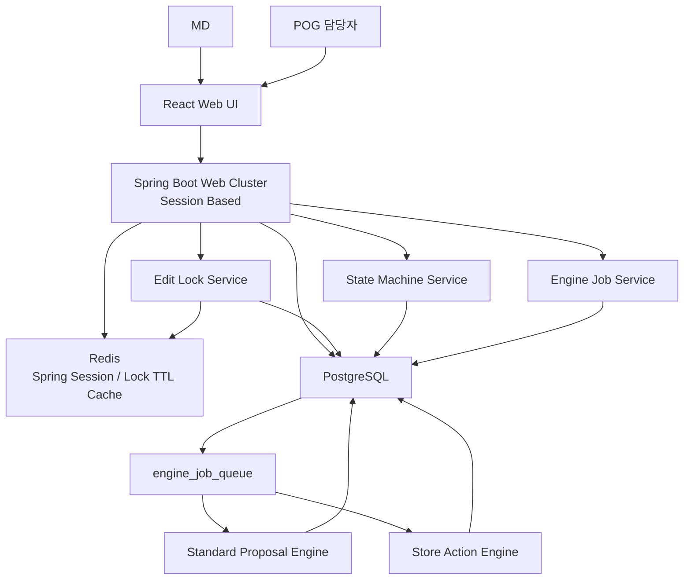

# POG 동시성 및 상태 관리 설계서

## 1. 목적

본 문서는 다수 사용자가 POG 시스템에 동시에 로그인하여 표준진열대장, 점별진열대장, 프로젝트, Action List, 엔진 실행 요청을 처리할 때 발생할 수 있는 충돌을 방지하기 위한 상태 관리, 잠금 기능, 엔진 job 처리 아키텍처를 정의한다.

POG 시스템의 주요 사용자는 다음과 같이 구분한다.

| 사용자 | 주요 업무 |
|---|---|
| MD | 표준진열대장 생성, 상품 라이브러리 구성, 스코어링, 표준진열제안 검토 및 확정 |
| POG 담당자 | 점별진열대장 생성, Action List 설정/실행, 점포별 결과 검토 |
| 운영자 | 마스터, 권한, 공통코드, 배치 상태 관리 |

동시성 설계의 목표는 동일한 업무 대상에 대해 여러 사용자가 동시에 수정하거나 삭제하여 데이터가 유실되는 것을 방지하고, 엔진이 여러 진열 요청을 개별 job으로 안정적으로 처리하도록 하는 것이다.

## 2. 설계 범위

| 범위 | 설명 |
|---|---|
| 사용자 세션 | Spring Boot 클러스터 환경의 로그인 세션 유지 |
| 권한 통제 | 사용자 역할별 수정/삭제/실행 권한 검증 |
| 편집 잠금 | 동일 진열대장, 프로젝트, Action List의 동시 편집 방지 |
| 낙관적 락 | 저장 시점의 버전 충돌 감지 |
| 삭제 보호 | 편집 중이거나 엔진 실행 중인 대상 삭제 차단 |
| 상태 관리 | 진열대장, 프로젝트, Action List, 엔진 job의 상태 전이 관리 |
| 엔진 job 동시성 | 여러 요청을 개별 job으로 처리하되 동일 대상 중복 실행 방지 |
| 감사 이력 | 잠금, 해제, 저장 실패, 삭제 차단, job 실행 이력 추적 |

## 3. 전체 아키텍처



### 3.1 Spring Boot 역할

Spring Boot는 세션 기반 화면 서버로서 다음을 담당한다.

| 역할 | 설명 |
|---|---|
| 세션 확인 | Redis 기반 Spring Session으로 사용자 로그인 상태 확인 |
| 권한 검증 | MD, POG 담당자, 운영자 권한에 따라 화면 액션 허용 여부 판단 |
| 상태 검증 | 대상 객체의 현재 상태가 수정/삭제/실행 가능한지 확인 |
| 편집 잠금 관리 | 편집 화면 진입, 저장, 취소, 이탈 시 잠금 생성/연장/해제 |
| 버전 검증 | 저장 시 `version_no` 비교로 낙관적 락 수행 |
| job 생성 | 엔진 요청을 `engine_job_queue`에 개별 job으로 등록 |
| 감사 로그 | 잠금, 저장, 삭제, 실행 요청, 실패 사유 기록 |

### 3.2 Redis 역할

Redis는 원천 저장소가 아니라 세션과 짧은 수명의 상태 캐시로 사용한다.

| 대상 | 사용 방식 |
|---|---|
| 사용자 세션 | Spring Boot 클러스터 간 세션 공유 |
| 로그인 컨텍스트 | 사용자, 역할, 권한 범위 캐시 |
| 편집 잠금 TTL 보조 | DB 잠금의 만료 여부를 빠르게 확인하기 위한 보조 캐시 |
| 화면 상태 | 사용자별 최근 편집 대상, 그리드 설정 등 |

편집 잠금의 원장은 DB로 둔다. Redis 잠금만 사용하면 장애나 재시작 시 감사성과 복구성이 약해질 수 있으므로, Redis는 TTL 조회 최적화 용도로 제한한다.

## 4. 동시성 제어 전략

POG 시스템은 비관적 잠금과 낙관적 잠금을 함께 사용한다.

| 전략 | 적용 대상 | 목적 |
|---|---|---|
| 편집 잠금 | 화면에서 장시간 편집되는 진열대장, Action List, 프로젝트 | 동시에 같은 대상을 수정하지 못하게 사전 차단 |
| 낙관적 락 | 모든 저장성 마스터/업무 테이블 | 저장 직전 다른 사용자의 선행 저장 감지 |
| 상태 기반 잠금 | 엔진 실행 중인 프로젝트/진열대장 | 실행 중 수정/삭제 방지 |
| job scope 중복 제한 | 엔진 job | 동일 대상 중복 실행 방지 |

편집 잠금만으로는 브라우저 종료, 네트워크 단절, 세션 만료를 모두 완벽히 통제할 수 없다. 따라서 저장 시점에는 반드시 `version_no`를 비교한다.

## 5. 편집 잠금 설계

### 5.1 잠금 대상

| object_type | 잠금 대상 |
|---|---|
| STANDARD_PLANOGRAM | 표준진열대장 |
| STORE_PLANOGRAM | 점별진열대장 |
| PROJECT | 진열단위 프로젝트 |
| ACTION_LIST | Action List |
| DISPLAY_UNIT | 진열단위 |
| PLANOGRAM_MAPPING | 표준/점별 진열대장 매핑 |

### 5.2 잠금 획득

사용자가 편집 화면에 진입하면 Spring Boot는 다음 순서로 잠금을 획득한다.

```text
1. 사용자 세션 확인
2. 대상 객체 조회
3. 권한 확인
4. 상태 확인
5. 기존 유효 잠금 확인
6. 유효 잠금이 없으면 pog_edit_lock 생성
7. 잠금 토큰을 화면에 전달
```

이미 다른 사용자가 잠금 중이면 편집 화면은 읽기 전용으로 열거나 진입을 차단한다.

### 5.3 잠금 유지와 만료

| 항목 | 정책 |
|---|---|
| 기본 TTL | 30분 |
| 연장 방식 | 편집 화면에서 1~5분 주기로 heartbeat |
| 최대 유지 시간 | 운영 정책에 따라 4~8시간 권장 |
| 세션 종료 | 해당 사용자의 잠금 해제 |
| TTL 만료 | 다른 사용자가 잠금 획득 가능 |
| 강제 해제 | 운영자 또는 권한 있는 관리자만 가능 |

TTL은 사용자의 장시간 편집을 고려하되, 브라우저 비정상 종료 시 영구 잠금이 남지 않도록 설정한다.

### 5.4 잠금 해제

잠금은 다음 이벤트에서 해제한다.

| 이벤트 | 처리 |
|---|---|
| 저장 성공 | 잠금 해제 |
| 취소 | 잠금 해제 |
| 화면 이탈 | 가능한 경우 잠금 해제 요청 |
| 세션 로그아웃 | 사용자 보유 잠금 해제 |
| TTL 만료 | 만료 상태로 간주 |
| 강제 해제 | 감사 로그 기록 후 해제 |

## 6. 낙관적 락 설계

수정 가능한 주요 테이블에는 `version_no`를 둔다.

```text
version_no integer not null default 1
```

저장 시에는 화면이 조회한 버전과 DB 현재 버전을 비교한다.

```sql
UPDATE pog_planogram
SET
  planogram_name = :planogram_name,
  version_no = version_no + 1,
  updated_by = :user_id,
  updated_at = now()
WHERE planogram_id = :planogram_id
  AND version_no = :screen_version_no;
```

영향 행 수가 0이면 다른 사용자가 먼저 수정한 것으로 판단하고 저장을 실패 처리한다.

화면 메시지 예시:

```text
다른 사용자가 먼저 저장하여 현재 화면의 내용이 최신 상태가 아닙니다. 최신 정보를 다시 조회한 후 수정해 주세요.
```

## 7. 삭제 보호 설계

삭제 요청은 즉시 삭제하지 않고 다음 조건을 검증한다.

| 검증 항목 | 차단 조건 |
|---|---|
| 편집 잠금 | 다른 사용자의 유효 잠금이 존재 |
| 엔진 실행 | 대상 관련 job이 READY/RUNNING |
| 상태 | CONFIRMED, PUBLISHED, STORE_GENERATING 등 삭제 불가 상태 |
| 참조 관계 | 확정 프로젝트, 점별진열대장, 실행 이력이 참조 중 |
| 권한 | 사용자 역할이 삭제 권한 없음 |

삭제는 물리 삭제보다 논리 삭제를 기본으로 한다.

```text
status = DELETED
deleted_by
deleted_at
delete_reason
```

마스터성 데이터는 이력과 재현성이 중요하므로 물리 삭제는 운영자 정리 배치 또는 별도 아카이빙 정책으로 제한한다.

## 8. 상태 관리 설계

### 8.1 표준진열대장 상태

| 상태 | 설명 | 수정 | 삭제 |
|---|---|---|---|
| DRAFT | 작성 중 | 가능 | 가능 |
| EDITING | 편집 잠금 중 | 잠금 사용자만 가능 | 불가 |
| SCORING_RUNNING | 스코어링 실행 중 | 불가 | 불가 |
| PROPOSAL_RUNNING | 표준진열제안 실행 중 | 불가 | 불가 |
| PROPOSED | 진열제안 생성 완료 | 가능 | 제한 |
| CONFIRMED | 확정 | 제한 | 불가 |
| DELETED | 삭제 | 불가 | 불가 |

### 8.2 점별진열대장 상태

| 상태 | 설명 | 수정 | 삭제 |
|---|---|---|---|
| DRAFT | 생성 전 또는 작성 중 | 가능 | 가능 |
| EDITING | 편집 잠금 중 | 잠금 사용자만 가능 | 불가 |
| STORE_GENERATING | 점별진열대장 생성 중 | 불가 | 불가 |
| PREVIEWED | 미리보기 생성 완료 | 가능 | 제한 |
| APPLIED | Action List 적용 완료 | 제한 | 제한 |
| PUBLISHED | 실제 진열 적용 | 제한 | 불가 |
| DELETED | 삭제 | 불가 | 불가 |

### 8.3 프로젝트 상태

| 상태 | 설명 |
|---|---|
| DRAFT | 프로젝트 생성 및 상품 라이브러리 구성 중 |
| SCORING_READY | 스코어링 실행 가능 |
| SCORING_RUNNING | 스코어링 실행 중 |
| SCORED | 스코어링 완료 |
| PROPOSAL_RUNNING | 표준진열제안 실행 중 |
| PROPOSED | 진열제안 완료 |
| CONFIRMED | 프로젝트 확정 |
| STORE_JOB_RUNNING | 점별진열대장 생성 job 실행 중 |
| CLOSED | 점별 적용 완료 |
| CANCELED | 취소 |

### 8.4 상태 전이 원칙

- 상태 변경은 Spring Boot의 State Machine Service를 통해서만 수행한다.
- 화면은 상태값을 직접 변경하지 않는다.
- 상태 변경 전 권한, 잠금, job 상태, 참조 관계를 검증한다.
- 상태 변경 이력은 `pog_state_transition_log`에 저장한다.
- 확정 상태에서 이전 상태로 되돌릴 때는 rollback 권한과 사유를 필수로 입력한다.

## 9. 엔진 job 동시성 설계

### 9.1 개별 요청 처리

엔진은 여러 진열 요청을 각각 독립 job으로 처리한다.

| 항목 | 정책 |
|---|---|
| job 단위 | 표준진열제안, 점별진열대장 생성, preview, apply, batch |
| 처리 방식 | PostgreSQL job queue 기반 비동기 처리 |
| worker 점유 | `FOR UPDATE SKIP LOCKED` |
| 결과 저장 | job 단위 결과 테이블 및 snapshot 저장 |
| 실패 처리 | FAILED 상태와 오류 메시지 저장 |

### 9.2 동일 대상 중복 실행 방지

서로 다른 대상의 요청은 동시에 실행할 수 있다. 단, 동일 대상에 대한 중복 실행은 차단한다.

`engine_job_queue`에는 `job_scope_key`를 둔다.

| engine_type | job_scope_key 예시 |
|---|---|
| STANDARD_PROPOSAL | `STANDARD_PROPOSAL:{project_id}:{standard_planogram_id}` |
| STORE_ACTION_PREVIEW | `STORE_ACTION_PREVIEW:{project_id}:{store_id}:{store_planogram_id}` |
| STORE_ACTION_APPLY | `STORE_ACTION_APPLY:{project_id}:{store_id}:{store_planogram_id}` |
| SCORING | `SCORING:{project_id}:{scoring_policy_id}` |

동일 `job_scope_key`에 대해 `READY` 또는 `RUNNING` 상태 job은 하나만 허용한다.

```sql
CREATE UNIQUE INDEX ux_engine_job_active_scope
ON engine_job_queue(job_scope_key)
WHERE status IN ('READY', 'RUNNING');
```

### 9.3 worker 병렬 처리

Python worker는 여러 개 실행할 수 있다.

```sql
SELECT job_id
FROM engine_job_queue
WHERE status = 'READY'
ORDER BY priority DESC, requested_at
FOR UPDATE SKIP LOCKED
LIMIT 1;
```

이 방식은 여러 worker가 동시에 조회해도 하나의 job이 한 worker에게만 점유되도록 보장한다.

### 9.4 job과 업무 객체 상태 연동

| job 이벤트 | 업무 상태 |
|---|---|
| job 생성 | 대상 상태를 RUNNING 계열로 변경 |
| job 성공 | SCORED, PROPOSED, PREVIEWED, APPLIED 등으로 변경 |
| job 실패 | 이전 안정 상태로 복귀하거나 FAILED 상태 유지 |
| job 취소 | CANCELED 처리 후 이전 상태 복귀 |
| worker timeout | RUNNING timeout 감지 후 재시도 또는 FAILED |

상태 변경과 job 생성은 하나의 DB 트랜잭션으로 처리한다.

## 10. 데이터 모델

### 10.1 pog_edit_lock

| 컬럼 | 설명 |
|---|---|
| lock_id | 잠금 ID |
| object_type | 잠금 대상 유형 |
| object_id | 잠금 대상 ID |
| lock_token | 화면 저장 시 전달받는 잠금 토큰 |
| locked_by | 잠금 사용자 |
| locked_by_name | 잠금 사용자명 |
| session_id | 사용자 세션 ID |
| locked_at | 잠금 시작일시 |
| expires_at | 잠금 만료일시 |
| heartbeat_at | 마지막 heartbeat 일시 |
| lock_status | ACTIVE / RELEASED / EXPIRED / FORCE_RELEASED |
| release_reason | SAVE / CANCEL / LOGOUT / TIMEOUT / FORCE |
| released_at | 해제일시 |

유효 잠금 중복 방지 인덱스:

```sql
CREATE UNIQUE INDEX ux_pog_edit_lock_active
ON pog_edit_lock(object_type, object_id)
WHERE lock_status = 'ACTIVE';
```

### 10.2 pog_state_transition_log

| 컬럼 | 설명 |
|---|---|
| transition_id | 상태 전이 ID |
| object_type | 대상 유형 |
| object_id | 대상 ID |
| from_status | 이전 상태 |
| to_status | 변경 상태 |
| transition_reason | 변경 사유 |
| job_id | 관련 job ID |
| changed_by | 변경자 |
| changed_at | 변경일시 |

### 10.3 pog_concurrency_event_log

| 컬럼 | 설명 |
|---|---|
| event_id | 이벤트 ID |
| event_type | LOCK_ACQUIRED / LOCK_DENIED / VERSION_CONFLICT / DELETE_DENIED / JOB_DUPLICATED |
| object_type | 대상 유형 |
| object_id | 대상 ID |
| user_id | 사용자 |
| session_id | 세션 ID |
| detail_json | 상세 정보 |
| created_at | 생성일시 |

### 10.4 공통 업무 테이블 필수 컬럼

수정 가능한 업무 테이블에는 다음 공통 컬럼을 둔다.

| 컬럼 | 설명 |
|---|---|
| status | 업무 상태 |
| version_no | 낙관적 락 버전 |
| created_by | 생성자 |
| created_at | 생성일시 |
| updated_by | 수정자 |
| updated_at | 수정일시 |
| deleted_by | 삭제자 |
| deleted_at | 삭제일시 |

## 11. 화면 처리 흐름

### 11.1 편집 화면 진입

```text
1. 사용자가 편집 버튼 클릭
2. Spring Boot가 세션과 권한 확인
3. 대상 상태 확인
4. 유효 잠금 확인
5. 잠금 가능하면 lock_token 발급
6. 화면은 lock_token, version_no, expires_at을 보관
7. 편집 중 heartbeat 전송
```

### 11.2 저장

```text
1. 화면에서 저장 요청
2. 세션 확인
3. lock_token 유효성 확인
4. 상태 확인
5. version_no 비교
6. 저장 및 version_no 증가
7. 변경 이력 저장
8. 잠금 해제
9. 최신 결과 반환
```

### 11.3 삭제

```text
1. 삭제 요청
2. 세션과 권한 확인
3. 유효 잠금 확인
4. 관련 READY/RUNNING job 확인
5. 참조 관계 확인
6. 삭제 가능 상태 확인
7. 논리 삭제 처리
8. 상태 변경 이력 저장
```

### 11.4 엔진 실행 요청

```text
1. 생성/미리보기/적용 버튼 클릭
2. 세션과 권한 확인
3. 대상 상태 확인
4. 편집 잠금 여부 확인
5. job_scope_key 생성
6. 동일 scope의 READY/RUNNING job 확인
7. 업무 상태 RUNNING 변경
8. engine_job_queue insert
9. 화면은 job 상태 조회
```

## 12. 충돌 처리 메시지

| 상황 | 화면 메시지 방향 |
|---|---|
| 다른 사용자 편집 중 | 현재 {사용자명} 사용자가 편집 중입니다. 읽기 전용으로 조회하거나 잠금 해제 후 다시 시도해 주세요. |
| 버전 충돌 | 다른 사용자가 먼저 저장했습니다. 최신 정보를 다시 조회한 후 수정해 주세요. |
| 삭제 차단 | 현재 편집 중이거나 실행 중인 작업이 있어 삭제할 수 없습니다. |
| job 중복 | 동일 대상의 생성 작업이 이미 실행 중입니다. 작업 상태를 확인해 주세요. |
| TTL 만료 | 편집 시간이 만료되었습니다. 최신 정보를 다시 조회한 후 수정해 주세요. |

## 13. 권한과 역할

| 기능 | MD | POG 담당자 | 운영자 |
|---|---|---|---|
| 표준진열대장 편집 | 가능 | 조회 | 가능 |
| 표준진열제안 실행 | 가능 | 조회 | 가능 |
| 프로젝트 확정 | 가능 | 조회 | 가능 |
| 점별진열대장 생성 | 조회 | 가능 | 가능 |
| Action List 편집 | 제한 | 가능 | 가능 |
| 잠금 강제 해제 | 불가 | 불가 | 가능 |
| 삭제 | 제한 | 제한 | 가능 |

상세 권한은 메뉴 권한, 버튼 권한, 대상 카테고리 권한, 점포 권한을 조합하여 판단한다.

## 14. 운영 및 복구

### 14.1 만료 잠금 정리

만료된 잠금은 주기적으로 정리한다.

```text
ACTIVE 상태이고 expires_at < now()인 잠금
→ EXPIRED 상태로 변경
→ Redis 보조 키 삭제
→ 이벤트 로그 저장
```

### 14.2 RUNNING job timeout

RUNNING 상태가 기준 시간을 초과하면 worker 장애 가능성이 있으므로 다음 정책을 적용한다.

| 조건 | 처리 |
|---|---|
| retry_count < max_retry_count | READY로 되돌려 재시도 |
| retry_count >= max_retry_count | FAILED 처리 |
| 사용자 취소 요청 | CANCELED 처리 |

### 14.3 강제 해제

운영자가 잠금을 강제 해제할 수 있으나, 다음 정보를 반드시 남긴다.

| 항목 | 설명 |
|---|---|
| 강제 해제자 | 운영자 ID |
| 대상 | object_type, object_id |
| 기존 잠금 사용자 | locked_by |
| 사유 | force_release_reason |
| 일시 | released_at |

## 15. 구현 원칙

- 화면 저장 요청은 반드시 `lock_token`과 `version_no`를 포함한다.
- 잠금 원장은 DB에 저장하고 Redis는 보조 캐시로 사용한다.
- 업무 상태 변경과 job 생성은 하나의 트랜잭션으로 처리한다.
- 동일 대상의 READY/RUNNING job은 DB unique index로 최종 방어한다.
- 모든 수정/삭제/실행 요청은 Spring Boot 화면 서버를 경유한다.
- Python 엔진은 job 점유와 결과 저장만 수행하고 사용자 세션 판단은 하지 않는다.
- 엔진은 처리 시작 시 대상 상태와 job 상태를 다시 확인하여 중복 실행을 방지한다.
- 확정 또는 게시된 POG는 직접 수정하지 않고 새 버전 또는 새 프로젝트로 파생하는 것을 기본으로 한다.

## 16. 최종 권장안

POG 시스템은 다음 구조로 동시성을 제어한다.

```text
사용자 세션: Redis Spring Session
화면 액션: Spring Boot Controller
사전 충돌 방지: pog_edit_lock 편집 잠금
최종 저장 충돌 방지: version_no 낙관적 락
삭제 보호: 상태 + 잠금 + job + 참조 관계 검증
엔진 병렬 처리: PostgreSQL job queue + FOR UPDATE SKIP LOCKED
동일 대상 중복 방지: job_scope_key unique index
감사 추적: lock/state/concurrency event log
```

이 구조를 적용하면 MD와 POG 담당자가 동시에 시스템을 사용하더라도 동일 진열대장에 대한 수정/삭제 충돌을 방지할 수 있고, 표준진열제안 및 점별진열대장 생성 요청은 개별 job으로 안정적으로 병렬 처리할 수 있다.
