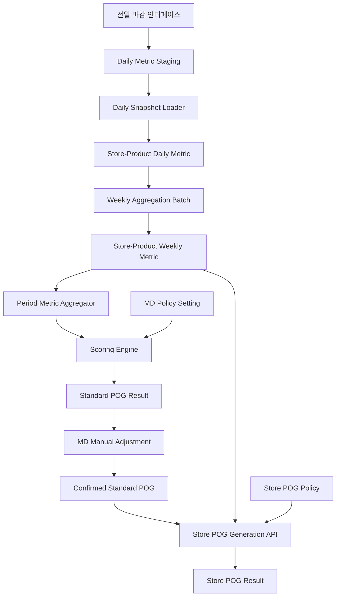

# POG 진열 스코어링 서버 엔진 설계서

## 1. 목적

POG 시스템에서 상품별 진열 우선순위를 자동 산정하기 위해 판매성, 수익성, 고객가치, 공급안정성, 프로모션, 재고효율, 운영품질, 규모지표를 종합하여 상품별 진열 스코어를 계산하는 서버 엔진을 개발한다.

엔진은 점포-상품 단위의 일별 마감 자료를 입력받아 주별 집계 자료를 생성하고, MD가 설정한 진열대 유형별 지표, 가중치, 참조 주차 범위를 기준으로 표준 POG와 점포별 POG 스코어링을 수행한다. 이후 MD 수동 조정을 거쳐 최종 표준 POG 및 점포별 POG를 생성한다.

본 설계의 핵심 대상은 다음 두 가지이다.

- 전점 기준 표준 POG 스코어링
- 표준 POG 상품을 기준으로 한 점포별 POG 스코어링

또한 여름 시즌, 겨울 시즌처럼 기존 최근 실적보다 전년 동시즌 실적을 기준으로 표준 POG 초안을 생성해야 하는 경우를 지원한다. 시즌 POG는 별도의 집계 테이블을 만들지 않고 일반 주별 집계 테이블을 동일하게 사용하며, 참조 주차 범위만 전년 동시즌으로 선택하여 스코어링한다.

## 2. 스코어링 기준

| No | 지표명 | 정의 | 그룹 | 가중치(%) |
|---:|---|---|---|---:|
| 1 | 순매출액 | 세금과 에누리액을 제외한 순수 매출액 | A | 20 |
| 2 | 판매수량 | 상품 판매 수량 | A | 15 |
| 3 | 상품이익률 | 순매출액 대비 상품 이익액 비중 | A | 15 |
| 4 | 행사순매출액 | 진성행사상품 순매출액 | A | 10 |
| 5 | 결품수 | 전산 및 점포에서 품절로 확인되는 상품 수량 | B | 10 |
| 6 | 재고보유일수 | 재고 판매하기까지의 평균 보유 일수 | C | 5 |
| 7 | 폐기수량 | 폐기 등록된 상품의 폐기 처리 수량 | B | 7 |
| 8 | 센터반품수량 | 점포 기준 파트너사 및 센터 반품 수량 | B | 5 |
| 9 | 매출원가 | 매출원가를 구성하는 금액의 총합 | D | 3 |
| 10 | 원거래 반품건수 | 영수증 반품 건수 | B | 3 |
| 11 | 원거래 반품액 | 영수증 반품 금액 | B | 3 |
| 12 | 센터입고 수량 | 파트너사로부터 센터로 입고된 상품 수량 | D | 2 |
| 13 | RFMP 고객 등급 | RFMP 기준 고객 등급 | E | 2 |
| 합계 |  |  |  | 100 |

스코어링은 지표별 원천값을 그대로 선형 점수로 사용하지 않고, 지표 성격에 따라 A~E 그룹의 기준점수로 변환한 뒤 가중치를 적용한다.

## 3. 핵심 계산 방식

### 3.1 기본 공식

```text
최종 진열 스코어 = Σ(지표별 기준점수 × 지표별 가중치 / 100)
```

각 지표는 A~E 그룹별 점수화 방식에 따라 0~100점의 기준점수로 변환한 뒤 가중치를 적용한다. 그룹 A/B는 min-max 정규화 점수를 구간 기준점수로 변환하고, 그룹 C/D/E는 각각 초과일수, ABC 누적 구성비, 확정 등급 기준으로 기준점수를 산출한다.

```text
가중 점수 = 기준점수 × 가중치 / 100
```

최종 점수는 0~100 범위로 산출한다.

### 3.2 POG 생성 단계

POG 생성은 표준 POG와 점포별 POG를 분리하여 처리한다.

```text
점포-상품 일별 마감 자료
→ 점포-상품 주별 집계 자료
→ MD 표준 POG 스코어링 정책 설정
→ 전점 기준 표준 POG 스코어링
→ MD 수동 조정
→ 최종 표준 POG 확정
→ MD 점포별 POG 생성 요청
→ 점포별 POG 스코어링 정책 적용
→ 점포별 POG 생성
```

표준 POG는 전점 기준의 상품 경쟁력을 평가하는 목적이고, 점포별 POG는 확정된 표준 POG 상품 목록 안에서 점포별 실적 특성을 반영하여 진열 우선순위를 재산정하는 목적이다.

### 3.3 주차 기반 참조 기간

MD는 스코어링 정책을 설정할 때 참조 기간을 주차 단위로 선택한다.

예시:

```text
참조 시작 주차: 2026-W31
참조 종료 주차: 2026-W34
```

시스템은 선택된 주차 범위의 주별 집계 자료를 조회하고, 지표별 기간 집계 방식에 따라 스코어링 입력값을 생성한다.

### 3.4 시즌 POG 생성 방식

시즌 POG는 일반 표준 POG와 동일한 스코어링 엔진, 동일한 주별 집계 테이블을 사용한다. 차이는 참조 기간 유형이다.

```text
일반 표준 POG = 최근 주차 또는 MD 선택 주차 기준
시즌 표준 POG = 전년 동시즌 주차 기준
```

시즌 POG는 별도 예측 모델이나 별도 시즌 집계 데이터를 사용하지 않는다. 시스템은 전년 동시즌 실적을 기준으로 객관적인 표준 POG 초안을 제시하고, 신상품, 전략상품, 트렌드, 협력사 이슈 등 정성 판단은 MD가 표준 POG 수동 조정 단계에서 반영한다.

참조 기간 유형은 다음과 같이 관리한다.

| 참조 기간 유형 | 설명 |
|---|---|
| RECENT_WEEKS | 최근 N주 실적 기준 |
| MANUAL_WEEK_RANGE | MD가 직접 선택한 주차 범위 기준 |
| SAME_SEASON_LAST_YEAR | 전년 동시즌 주차 범위 기준 |

예시:

```text
2027년 여름 시즌 POG 생성
→ 참조 기간 유형: SAME_SEASON_LAST_YEAR
→ 참조 주차: 2026년 여름 시즌 대상 주차
→ 사용 테이블: store_product_weekly_metric
```

## 4. 지표 방향성

모든 지표가 높을수록 좋은 것은 아니므로 지표별 방향성을 분리한다.

| 지표 | 방향성 | 설명 |
|---|---|---|
| 순매출액 | 높을수록 좋음 | 매출 기여도 |
| 판매수량 | 높을수록 좋음 | 수요 및 구매빈도 |
| 상품이익률 | 높을수록 좋음 | 수익성 |
| RFMP 고객등급 | 높을수록 좋음 | 우수 고객 선호도 |
| 센터입고 수량 | 높을수록 좋음 | 공급 지속 가능성 |
| 행사순매출액 | 높을수록 좋음 | 프로모션 반응도 |
| 재고보유일수 | 낮을수록 좋음 | 재고 회전성 |
| 결품수 | 낮을수록 좋음 | 운영 안정성 |
| 폐기수량 | 낮을수록 좋음 | 손실 최소화 |
| 센터반품수량 | 낮을수록 좋음 | 반품 리스크 |
| 원거래 반품건수 | 낮을수록 좋음 | 고객 불만족 지표 |
| 원거래 반품액 | 낮을수록 좋음 | 반품 영향도 |
| 매출원가 | 정책 선택 | 상품 규모 참고지표 |

매출원가는 상품 규모를 나타내는 참고지표이므로 기본 정책은 "높을수록 좋음"으로 두되, 카테고리별 정책 설정이 가능하도록 설계한다.

## 5. 정규화 방식

### 5.1 그룹 A: 높은 값이 좋은 지표

그룹 A는 높은 값이 좋은 지표에 적용한다. 먼저 선택 기간의 지표값을 비교군 내 min-max 방식으로 정규화한 뒤, 정규화 점수 구간에 따라 기준점수를 부여한다.

```text
정규화 점수(%) = (value - min) / (max - min) × 100
```

| 정규화 점수 구간 | 기준점수 |
|---:|---:|
| 80% 이상 | 100 |
| 60% 이상 ~ 80% 미만 | 80 |
| 40% 이상 ~ 60% 미만 | 60 |
| 20% 이상 ~ 40% 미만 | 40 |
| 20% 미만 | 20 |

대상 지표:

- 순매출액
- 판매수량
- 상품이익률
- 행사순매출액

### 5.2 그룹 B: 낮은 값이 좋은 지표

그룹 B는 낮은 값이 좋은 지표에 적용한다. 먼저 선택 기간의 지표값을 역방향 min-max 방식으로 정규화한 뒤, 정규화 점수 구간에 따라 기준점수를 부여한다.

```text
역방향 정규화 점수(%) = (max - value) / (max - min) × 100
```

| 역방향 정규화 점수 구간 | 기준점수 |
|---:|---:|
| 80% 이상 | 100 |
| 60% 이상 ~ 80% 미만 | 80 |
| 40% 이상 ~ 60% 미만 | 60 |
| 20% 이상 ~ 40% 미만 | 40 |
| 20% 미만 | 20 |

대상 지표:

- 결품수
- 폐기수량
- 센터반품수량
- 원거래 반품건수
- 원거래 반품액

### 5.3 그룹 C: 재고보유일수 기준일수 초과 감점

그룹 C는 재고보유일수에 적용한다. 먼저 기간 재고보유일수를 계산하고, 카테고리별 표준 보유일수 대비 초과일수를 산출한 뒤 초과 구간별 기준점수를 부여한다.

```text
초과일수 = 기간 재고보유일수 - 카테고리별 표준 보유일수
```

| 초과일수 구간 | 기준점수 |
|---|---:|
| 기준일수 이하 | 100 |
| 1일 ~ 15일 | 90 |
| 16일 ~ 20일 | 80 |
| 21일 ~ 35일 | 70 |
| 36일 ~ 60일 | 60 |
| 60일 초과 | 50 |

대상 지표:

- 재고보유일수

### 5.4 그룹 D: ABC 누적 구성비 방식

일부 지표는 기간 합계값을 그대로 min-max 정규화하지 않고, 합계값 기준 내림차순 정렬 후 누적 구성비를 계산하여 ABC 등급 점수로 변환한다.

대상 지표:

- 센터입고 수량
- 매출원가

적용 방식:

```text
1. 선택 기간의 상품별 지표 합계 계산
2. 합계값 기준 내림차순 정렬
3. 전체 합계 대비 상품별 구성비 계산
4. 누적 구성비 계산
5. 누적 구성비 구간에 따라 A/B/C 등급 부여
6. 등급별 점수를 기준점수로 사용
```

기본 ABC 구간은 다음과 같이 설정한다. 여기서 상위 70%는 상품 개수 기준이 아니라 지표 합계의 누적 구성비 기준이다.

| 누적 구성비 | 등급 | 기준점수 |
|---:|---|---:|
| 0% 초과 ~ 70% 이하 | A | 100 |
| 70% 초과 ~ 90% 이하 | B | 80 |
| 90% 초과 ~ 100% 이하 | C | 60 |
| 값 없음 또는 0 | 미분류 | 0 |

센터입고 수량은 공급 규모와 운영 중요도를 판단하기 위한 지표이고, 매출원가는 상품 규모 참고지표이다. 두 지표 모두 값이 크다고 선형적으로 높은 점수를 부여하기보다, 비교군 내 중요 구간을 구분하는 ABC 방식이 적합하다.

ABC 누적 구성비는 반드시 동일 비교군 안에서 계산한다.

```text
표준 POG: 진열대 유형 + 전점 기준 대상 상품군
점포별 POG: 점포 + 진열대 유형 + 표준 POG 대상 상품군
```

### 5.5 그룹 E: RFMP 고객 등급

그룹 E는 RFMP 기준으로 확정된 고객 등급을 고정 기준점수로 변환한다.

| RFMP 등급 | 기준점수 |
|---|---:|
| MVG | 100 |
| VIP | 80 |
| GOLD | 60 |
| ACE | 40 |
| 등급 없음 또는 매핑 불가 | 0 |

대상 지표:

- RFMP 고객 등급

### 5.6 예외 처리

| 상황 | 처리 |
|---|---|
| max = min | 기본 50점 부여 |
| 값 없음 | 지표별 기본값 또는 제외 정책 적용 |
| 음수 값 | 지표 정의에 따라 0 보정 또는 허용 |
| 이상치 | percentile cap 적용 가능 |
| 신규 상품 | 별도 cold-start 보정 적용 |
| ABC 계산 대상 전체 합계 = 0 | 대상 지표 전체 0점 또는 정책별 기본점 적용 |

## 6. 서버 아키텍처



## 7. 주요 컴포넌트

### 7.1 Scoring API

스코어링 요청을 수신하고 표준 POG 또는 점포별 POG 계산을 수행한다.

주요 역할:

- 표준 POG 스코어링 실행
- 점포별 POG 스코어링 실행
- 진열대 유형별 정책 조회
- 참조 주차 범위 기준 기간 지표 생성
- 스코어링 결과 및 상세 점수 저장
- 일반/시즌 POG 생성 유형에 따른 참조 기간 해석

### 7.2 Validation Layer

입력 데이터의 유효성을 검증한다.

검증 항목:

- 필수 상품 ID 존재 여부
- 지표값 숫자 타입 여부
- 음수 허용 여부
- 기준 기간 유효성
- 카테고리 코드 존재 여부
- 진열대 유형 코드 존재 여부
- 스코어링 정책의 가중치 합계 유효성
- 참조 주차 범위의 주별 집계 자료 존재 여부

### 7.3 Daily Metric Loader

전일 마감 기준으로 인터페이스된 점포-상품 단위 일별 집계 자료를 적재한다.

주요 원칙:

- 일별 자료는 덮어쓰지 않고 기준일 단위로 누적한다.
- 동일 `base_date`, `store_id`, `product_id` 자료가 재수신될 수 있으므로 upsert 방식으로 적재한다.
- 원본 수신 자료는 staging 테이블에 먼저 적재하고, 검증 완료 후 확정 테이블로 반영한다.
- 인터페이스 배치 ID를 저장하여 수신, 검증, 반영 이력을 추적한다.

### 7.4 Weekly Aggregation Batch

일별 자료를 기준으로 점포-상품 단위의 주별 집계 자료를 생성한다.

주별 집계 자료에는 스코어링에 바로 사용할 수 있는 주간 지표값과, 여러 주차를 다시 집계할 때 필요한 원천 구성값을 함께 저장한다. 예를 들어 상품이익률은 주간 이익률만 저장하지 않고 주간 순매출액, 상품이익액도 함께 보관한다.

### 7.5 Period Metric Aggregator

MD가 선택한 참조 주차 범위에 따라 주별 집계 자료를 기간 지표값으로 변환한다.

금액, 수량, 건수 지표는 선택 주차의 합계를 사용하고, 비율 지표는 분자 합계와 분모 합계를 이용해 재계산한다. 일수 및 등급 지표는 지표 정책에 따라 가중 평균, 단순 평균, 마지막 주차 값 중 하나를 사용한다.

시즌 POG의 경우에도 동일한 로직을 사용한다. `SAME_SEASON_LAST_YEAR` 참조 기간 유형이 지정되면 대상 시즌의 전년도 동시즌 주차를 산정한 뒤, 일반 주별 집계 테이블에서 해당 주차 데이터를 조회하여 기간 지표값을 생성한다.

### 7.6 Metric Normalizer

원천 지표값을 0~100 점수로 변환한다.

정규화 기준은 다음 단위로 관리할 수 있다.

- 전체 상품 기준
- 카테고리 기준
- 점포 기준
- POG 대상 상품군 기준
- 기간 기준

표준 POG 스코어링은 전점 기준 기간 집계값을 대상으로 정규화하고, 점포별 POG 스코어링은 동일 점포 내 표준 POG 대상 상품을 기준으로 정규화한다.

### 7.7 Weight Engine

정규화된 지표 점수에 가중치를 적용한다.

가중치는 진열대 유형별, 정책 유형별로 MD가 설정한다.

정책 유형:

- `STANDARD`: 전점 기준 표준 POG 생성용 정책
- `STORE`: 점포별 POG 생성용 정책

같은 진열대 유형이라도 표준 POG용 지표와 점포별 POG용 지표를 다르게 설정할 수 있다.

### 7.8 Score Aggregator

지표별 가중 점수를 합산해 최종 진열 스코어를 만든다.

결과 예시:

```json
{
  "productId": "P000123",
  "categoryId": "C010",
  "score": 82.45,
  "rank": 3,
  "grade": "A",
  "calculatedAt": "2026-08-17T10:30:00+09:00"
}
```

### 7.9 Manual Adjustment Manager

표준 POG 스코어링 결과에 대해 MD가 수동으로 순위, 진열 여부, 페이싱 수량 등을 조정할 수 있도록 한다.

시스템 산출값과 MD 조정값은 분리 저장한다. 최종 POG에는 MD 조정이 반영된 최종 순위와 최종 상품 목록을 사용한다.

## 8. API 설계

### 8.1 표준 POG 스코어링 실행

```http
POST /api/v1/pog/standard-pogs/scoring-runs
```

Request:

```json
{
  "shelfTypeId": "SHELF-FROZEN-01",
  "policyId": "POLICY-STD-001",
  "pogGenerationType": "NORMAL",
  "referencePeriodType": "MANUAL_WEEK_RANGE",
  "fromWeekId": "2026-W31",
  "toWeekId": "2026-W34",
  "createdBy": "MD001"
}
```

시즌 POG 요청 예시:

```json
{
  "shelfTypeId": "SHELF-FROZEN-01",
  "policyId": "POLICY-STD-SUMMER-001",
  "pogGenerationType": "SUMMER_SEASON",
  "referencePeriodType": "SAME_SEASON_LAST_YEAR",
  "targetSeasonYear": 2027,
  "referenceSeasonYear": 2026,
  "fromWeekId": "2026-W24",
  "toWeekId": "2026-W34",
  "createdBy": "MD001"
}
```

Response:

```json
{
  "standardPogId": "STD-POG-202608-001",
  "shelfTypeId": "SHELF-FROZEN-01",
  "status": "DRAFT",
  "itemCount": 120,
  "calculatedAt": "2026-08-17T10:30:00+09:00"
}
```

### 8.2 표준 POG 수동 조정 저장

```http
PUT /api/v1/pog/standard-pogs/{standardPogId}/items
```

Request:

```json
{
  "items": [
    {
      "productId": "P000123",
      "finalRank": 1,
      "displayYn": true,
      "facingQuantity": 3,
      "adjustReason": "MD 전략상품 우선 진열"
    }
  ]
}
```

### 8.3 표준 POG 확정

```http
POST /api/v1/pog/standard-pogs/{standardPogId}/confirm
```

### 8.4 점포별 POG 생성

```http
POST /api/v1/pog/store-pogs
```

Request:

```json
{
  "storePogName": "2026년 8월 냉동 진열대 점포별 POG",
  "standardPogId": "STD-POG-202608-001",
  "shelfTypeId": "SHELF-FROZEN-01",
  "policyId": "POLICY-STORE-001",
  "fromWeekId": "2026-W31",
  "toWeekId": "2026-W34",
  "storeIds": ["S001", "S002", "S003"],
  "createdBy": "MD001"
}
```

Response:

```json
{
  "storePogBatchId": "STORE-POG-BATCH-202608-001",
  "requestedStoreCount": 3,
  "status": "PROCESSING"
}
```

### 8.5 스코어링 결과 조회

```http
GET /api/v1/pog/scoring-runs/{scoringRunId}/items
```

Response:

```json
{
  "scoringRunId": "RUN-001",
  "items": [
    {
      "rank": 1,
      "productId": "P000001",
      "score": 91.2,
      "metricScores": [
        {
          "metricCode": "netSalesAmount",
          "periodValue": 15200000,
          "normalizedScore": 95.4,
          "baseScore": 100,
          "weight": 20,
          "weightedScore": 20.0
        }
      ]
    }
  ]
}
```

## 9. 데이터 모델

### 9.1 metric_definition

지표 정의 테이블.

| 컬럼 | 설명 |
|---|---|
| metric_code | 지표 코드 |
| metric_name | 지표명 |
| evaluation_area | 평가영역 |
| default_direction | 기본 방향성 |
| default_period_aggregation_type | 기본 기간 집계 방식 |
| default_scoring_method | 기본 점수화 방식 |
| numerator_metric_code | 비율 계산용 분자 지표 코드 |
| denominator_metric_code | 비율 계산용 분모 지표 코드 |
| enabled | 사용 여부 |

### 9.2 store_product_daily_metric

점포-상품 단위 일별 마감 자료.

| 컬럼 | 설명 |
|---|---|
| base_date | 기준일 |
| store_id | 점포 ID |
| product_id | 상품 ID |
| category_id | 카테고리 ID |
| net_sales_amount | 순매출액 |
| sales_quantity | 판매수량 |
| profit_amount | 상품이익액 |
| profit_rate | 상품이익률 |
| rfmp_grade | RFMP 고객등급 |
| center_inbound_quantity | 센터입고 수량 |
| promotion_net_sales_amount | 행사순매출액 |
| inventory_holding_days | 재고보유일수 |
| stockout_count | 결품수 |
| disposal_quantity | 폐기수량 |
| center_return_quantity | 센터반품수량 |
| original_transaction_return_count | 원거래 반품건수 |
| original_transaction_return_amount | 원거래 반품액 |
| cost_of_sales | 매출원가 |
| interface_batch_id | 인터페이스 배치 ID |
| created_at | 생성일시 |
| updated_at | 수정일시 |

기본키는 `base_date`, `store_id`, `product_id` 조합을 권장한다.

### 9.3 store_product_weekly_metric

점포-상품 단위 주별 집계 자료.

| 컬럼 | 설명 |
|---|---|
| week_id | 주차 ID |
| week_start_date | 주 시작일 |
| week_end_date | 주 종료일 |
| store_id | 점포 ID |
| product_id | 상품 ID |
| category_id | 카테고리 ID |
| net_sales_amount | 주간 순매출액 합계 |
| sales_quantity | 주간 판매수량 합계 |
| profit_amount | 주간 상품이익액 합계 |
| profit_rate | 주간 상품이익률 |
| rfmp_grade | 주간 RFMP 고객등급 |
| center_inbound_quantity | 주간 센터입고 수량 합계 |
| promotion_net_sales_amount | 주간 행사순매출액 합계 |
| inventory_holding_days_sum | 재고보유일수 합계 |
| inventory_holding_days_count | 재고보유일수 측정 건수 |
| inventory_holding_days_avg | 주간 재고보유일수 평균 |
| stockout_count | 주간 결품수 합계 |
| disposal_quantity | 주간 폐기수량 합계 |
| center_return_quantity | 주간 센터반품수량 합계 |
| original_transaction_return_count | 주간 원거래 반품건수 합계 |
| original_transaction_return_amount | 주간 원거래 반품액 합계 |
| cost_of_sales | 주간 매출원가 합계 |
| aggregated_at | 집계일시 |

주별 집계 테이블에는 주간 지표값과 기간 재집계에 필요한 구성값을 함께 저장한다.

### 9.4 pog_scoring_policy

MD가 설정하는 스코어링 정책 마스터.

| 컬럼 | 설명 |
|---|---|
| policy_id | 정책 ID |
| policy_name | 정책명 |
| policy_type | STANDARD / STORE |
| pog_generation_type | NORMAL / SUMMER_SEASON / WINTER_SEASON |
| reference_period_type | RECENT_WEEKS / MANUAL_WEEK_RANGE / SAME_SEASON_LAST_YEAR |
| shelf_type_id | 진열대 유형 ID |
| from_week_id | 참조 시작 주차 |
| to_week_id | 참조 종료 주차 |
| target_season_year | 대상 시즌 연도 |
| reference_season_year | 참조 시즌 연도 |
| status | DRAFT / ACTIVE / CLOSED |
| created_by | 생성 MD |
| created_at | 생성일시 |
| updated_at | 수정일시 |

### 9.5 pog_scoring_policy_metric

정책별 사용 지표와 가중치.

| 컬럼 | 설명 |
|---|---|
| policy_id | 정책 ID |
| metric_code | 지표 코드 |
| use_yn | 사용 여부 |
| weight | 가중치 |
| scoring_group | A / B / C / D / E |
| direction | HIGHER_IS_BETTER / LOWER_IS_BETTER |
| period_aggregation_type | 기간 집계 방식 |
| scoring_method | GROUP_A_MINMAX_BAND / GROUP_B_REVERSE_MINMAX_BAND / STANDARD_DAY_PENALTY / ABC_CUMULATIVE / FIXED_GRADE |
| abc_rule_set_id | ABC 기준 룰셋 ID |
| score_rule_set_id | 구간 점수 룰셋 ID |
| normalization_scope | 정규화 범위 |
| display_order | 화면 표시 순서 |

가중치 합계는 사용 지표 기준으로 100이 되도록 검증한다.

`센터입고 수량`과 `매출원가`는 기본적으로 `scoring_group = D`, `period_aggregation_type = SUM`, `scoring_method = ABC_CUMULATIVE`를 사용한다.

`재고보유일수`는 기본적으로 `scoring_group = C`, `period_aggregation_type = SUM_DIVIDE_COUNT`를 사용한다. 선택 주차의 재고보유일수 합계를 측정 건수 합계로 나누어 기간 재고보유일수를 산출한다. 산출된 기간 재고보유일수는 카테고리별 표준 보유일수와 비교하여 `STANDARD_DAY_PENALTY` 방식으로 점수화한다.

`RFMP 고객 등급`은 기본적으로 `scoring_group = E`, `period_aggregation_type = LAST_VALUE`, `scoring_method = FIXED_GRADE`를 사용한다.

### 9.5.1 score_rule_set

A~E 그룹별 기준점수 룰셋 마스터.

| 컬럼 | 설명 |
|---|---|
| score_rule_set_id | 룰셋 ID |
| rule_set_name | 룰셋명 |
| scoring_group | A / B / C / D / E |
| scoring_method | 점수화 방식 |
| enabled | 사용 여부 |
| created_by | 생성자 |
| created_at | 생성일시 |

### 9.5.2 score_rule_detail

기준점수 룰셋 상세.

| 컬럼 | 설명 |
|---|---|
| score_rule_set_id | 룰셋 ID |
| rule_order | 적용 순서 |
| from_value | 구간 시작값 |
| to_value | 구간 종료값 |
| grade_code | 등급 코드 |
| base_score | 기준점수 |
| description | 설명 |

그룹별 `from_value`, `to_value`의 의미는 다르다.

| 그룹 | 구간값 의미 |
|---|---|
| A | 정방향 정규화 점수 구간 |
| B | 역방향 정규화 점수 구간 |
| C | 카테고리 기준보유일수 대비 초과일수 구간 |
| D | 누적 구성비 구간 |
| E | RFMP 확정 등급 |

### 9.5.3 category_inventory_standard

재고보유일수 기준점수 산출을 위한 카테고리별 표준 보유일수.

| 컬럼 | 설명 |
|---|---|
| category_id | 카테고리 ID |
| shelf_type_id | 진열대 유형 ID |
| standard_holding_days | 표준 보유일수 |
| effective_start_date | 적용 시작일 |
| effective_end_date | 적용 종료일 |
| enabled | 사용 여부 |
| created_by | 생성자 |
| created_at | 생성일시 |

### 9.6 standard_pog_result

표준 POG 생성 결과 마스터.

| 컬럼 | 설명 |
|---|---|
| standard_pog_id | 표준 POG ID |
| shelf_type_id | 진열대 유형 ID |
| policy_id | 사용한 표준 POG 정책 |
| pog_generation_type | NORMAL / SUMMER_SEASON / WINTER_SEASON |
| reference_period_type | RECENT_WEEKS / MANUAL_WEEK_RANGE / SAME_SEASON_LAST_YEAR |
| from_week_id | 참조 시작 주차 |
| to_week_id | 참조 종료 주차 |
| target_season_year | 대상 시즌 연도 |
| reference_season_year | 참조 시즌 연도 |
| status | DRAFT / CONFIRMED |
| created_by | 생성 MD |
| confirmed_at | 확정일시 |

### 9.7 standard_pog_result_item

표준 POG 상품별 결과.

| 컬럼 | 설명 |
|---|---|
| standard_pog_id | 표준 POG ID |
| product_id | 상품 ID |
| system_score | 시스템 산출 점수 |
| system_rank | 시스템 산출 순위 |
| md_rank | MD 조정 순위 |
| final_rank | 최종 순위 |
| display_yn | 진열 여부 |
| facing_quantity | 페이싱 수량 |
| manual_adjust_yn | 수동 조정 여부 |
| adjust_reason | 조정 사유 |

### 9.8 store_pog_result

점포별 POG 생성 결과 마스터.

| 컬럼 | 설명 |
|---|---|
| store_pog_id | 점포별 POG ID |
| store_pog_name | 점포별 POG 생성명 |
| standard_pog_id | 기준 표준 POG ID |
| store_id | 점포 ID |
| shelf_type_id | 진열대 유형 ID |
| policy_id | 사용한 점포별 POG 정책 |
| from_week_id | 참조 시작 주차 |
| to_week_id | 참조 종료 주차 |
| status | CREATED / CONFIRMED |
| created_at | 생성일시 |

### 9.9 store_pog_result_item

점포별 POG 상품별 결과.

| 컬럼 | 설명 |
|---|---|
| store_pog_id | 점포별 POG ID |
| store_id | 점포 ID |
| product_id | 상품 ID |
| standard_rank | 표준 POG 최종 순위 |
| store_score | 점포별 스코어 |
| store_rank | 점포별 산출 순위 |
| final_rank | 최종 진열 순위 |

### 9.10 product_metric_score_detail

지표별 상세 점수.

| 컬럼 | 설명 |
|---|---|
| scoring_run_id | 스코어링 실행 ID |
| product_id | 상품 ID |
| metric_code | 지표 코드 |
| period_value | 기간 집계 지표값 |
| scoring_group | 스코어링 그룹 |
| scoring_method | 점수화 방식 |
| abc_grade | ABC 등급 |
| abc_composition_ratio | 구성비 |
| abc_cumulative_ratio | 누적 구성비 |
| normalized_score | 정규화 점수 |
| base_score | 구간 기준점수 |
| weight | 가중치 |
| weighted_score | 가중 점수 |

## 10. 주차 기간 집계 정책

주별 집계 자료 생성 시 지표값을 주 단위로 보관하되, MD가 여러 주차를 참조 기간으로 선택한 경우 모든 지표를 단순 평균하지 않는다.

기본 원칙은 다음과 같다.

```text
금액, 수량, 건수 계열 = 선택 주차 합계
비율 계열 = 분자 합계 / 분모 합계
일수, 등급 계열 = 합계/측정건수, 가중 평균, 단순 평균, 마지막 주차 값 중 정책 선택
```

기간 집계 방식 유형은 다음과 같이 관리한다.

| 유형 | 설명 | 대표 지표 |
|---|---|---|
| SUM | 선택 주차 합계 | 순매출액, 판매수량, 센터입고 수량, 매출원가 |
| RATIO_OF_SUMS | 분자 합계 / 분모 합계 | 상품이익률 |
| SUM_DIVIDE_COUNT | 값 합계 / 측정 건수 합계 | 재고보유일수 |
| AVERAGE | 선택 주차 단순 평균 | 등급성 보조 지표 |
| LAST_VALUE | 마지막 주차 값 | RFMP 고객등급 등 |

### 10.1 지표별 권장 기간 집계 방식

| 지표 | 주별 보관 방식 | 기간 선택 시 사용 방식 |
|---|---|---|
| 순매출액 | 주간 합계 | 선택 주차 합계 |
| 판매수량 | 주간 합계 | 선택 주차 합계 |
| 상품이익률 | 주간 이익률, 상품이익액, 순매출액 | 상품이익액 합계 / 순매출액 합계 |
| RFMP 고객등급 | 주간 등급 | 마지막 주차 값 |
| 센터입고 수량 | 주간 합계 | 선택 주차 합계 후 ABC 누적 구성비 점수화 |
| 행사순매출액 | 주간 합계 | 선택 주차 합계 |
| 재고보유일수 | 주간 합계, 측정 건수, 주간 평균 | 선택 주차 재고보유일수 합계 / 선택 주차 측정 건수 합계 |
| 결품수 | 주간 합계 | 선택 주차 합계 |
| 폐기수량 | 주간 합계 | 선택 주차 합계 |
| 센터반품수량 | 주간 합계 | 선택 주차 합계 |
| 원거래 반품건수 | 주간 합계 | 선택 주차 합계 |
| 원거래 반품액 | 주간 합계 | 선택 주차 합계 |
| 매출원가 | 주간 합계 | 선택 주차 합계 후 ABC 누적 구성비 점수화 |

### 10.2 비율 지표 재계산 예시

상품이익률은 주차별 이익률의 단순 평균을 사용하지 않고 기간 합산값으로 재계산한다.

```text
기간 상품이익률 = 선택 주차 상품이익액 합계 / 선택 주차 순매출액 합계
```

### 10.3 일수 지표 재계산 예시

재고보유일수는 `SUM_DIVIDE_COUNT` 계산 방식을 사용한다.

```text
기간 재고보유일수 =
Σ inventory_holding_days_sum / Σ inventory_holding_days_count
```

이 방식은 특정 주차의 데이터 건수가 적거나 결측이 있는 경우에도 기간 지표의 왜곡을 줄일 수 있다.

예시:

| 주차 | 재고보유일수 합계 | 측정 건수 |
|---|---:|---:|
| 2026-W31 | 126 | 7 |
| 2026-W32 | 140 | 7 |
| 2026-W33 | 133 | 7 |
| 2026-W34 | 385 | 7 |

```text
기간 재고보유일수 = (126 + 140 + 133 + 385) / (7 + 7 + 7 + 7)
= 784 / 28
= 28일
```

### 10.4 ABC 누적 구성비 지표 처리

센터입고 수량과 매출원가는 기간 지표값을 합계로 생성한 뒤, 해당 합계값을 기준으로 ABC 누적 구성비 점수화를 수행한다.

계산 예시:

```text
선택 주차 센터입고 수량 합계
→ 상품별 합계 내림차순 정렬
→ 전체 센터입고 수량 대비 구성비 계산
→ 누적 구성비 계산
→ A/B/C/D 등급 점수 부여
```

예시 기준:

| 누적 구성비 | 등급 | 점수 |
|---:|---|---:|
| 0% 초과 ~ 70% 이하 | A | 100 |
| 70% 초과 ~ 90% 이하 | B | 80 |
| 90% 초과 ~ 100% 이하 | C | 60 |
| 값 없음 또는 0 | 미분류 | 0 |

ABC 점수화는 기간 집계 이후 점수화 단계에서 수행한다. 따라서 원천 주별 집계 테이블에는 기존과 동일하게 주간 합계값을 저장하고, 별도의 ABC 집계값은 저장하지 않는다. 스코어 재현을 위해 스코어 상세에는 기간 합계값, ABC 등급, 누적 구성비, 기준점수를 함께 저장하는 것을 권장한다.

## 11. 시즌 POG 집계 데이터 정책

시즌 POG는 별도 시즌 전용 집계 테이블을 만들지 않고, 일반 주별 집계 테이블인 `store_product_weekly_metric`을 그대로 사용한다.

기본 원칙은 다음과 같다.

- 일반 POG와 시즌 POG의 물리 집계 테이블은 동일하다.
- 시즌 여부는 데이터 구조가 아니라 POG 생성 유형과 참조 기간 유형으로 구분한다.
- 여름/겨울 시즌 POG는 `SAME_SEASON_LAST_YEAR` 참조 기간 유형을 사용한다.
- 시스템은 전년 동시즌 주차 범위의 주별 집계 데이터를 조회하여 표준 POG 초안을 생성한다.
- 신상품이나 전년 실적이 없는 상품은 시스템 점수를 강제로 낮게 주지 않고 `미평가` 또는 `MD 검토 필요` 상태로 표시한다.
- MD 전략, 신상품 채택, 트렌드 판단은 표준 POG 수동 조정 단계에서 반영한다.

예시:

```text
2027년 여름 시즌 POG
→ 대상 시즌: 2027년 여름
→ 참조 시즌: 2026년 여름
→ 참조 데이터: store_product_weekly_metric의 2026년 여름 대상 주차
```

따라서 시즌 POG를 정상적으로 제시하려면 시스템 오픈 시점에 최소 과거 1년치의 점포-상품 주별 집계 자료가 존재해야 한다.

## 12. 등급 정책

최종 스코어에 따라 진열 추천 등급을 부여한다.

| 점수 | 등급 | 의미 |
|---:|---|---|
| 90 이상 | S | 최우선 진열 |
| 80 이상 | A | 우선 진열 |
| 70 이상 | B | 일반 진열 |
| 60 이상 | C | 제한 진열 |
| 60 미만 | D | 비추천 또는 검토 필요 |

## 13. 배치 처리 설계

### 13.1 일 배치

매일 영업 종료 후 전일 마감 기준 점포-상품 일별 집계 자료를 인터페이스하여 적재한다.

처리 순서:

1. 전일 마감 인터페이스 파일 또는 API 수신
2. staging 테이블 적재
3. 필수값, 숫자값, 코드값 검증
4. 오류 데이터 분리 및 배치 이력 저장
5. 점포-상품 일별 확정 테이블 upsert
6. 적재 완료 이력 저장

### 13.2 주 배치

주별 집계 기준일에 점포-상품 일별 자료를 주차 단위로 집계한다.

처리 순서:

1. 집계 대상 주차 산정
2. 해당 주차의 일별 자료 조회
3. 점포-상품 단위 금액, 수량, 건수 합계 생성
4. 비율 지표 계산에 필요한 분자, 분모 구성값 저장
5. 일수 지표 계산에 필요한 합계 및 측정 건수 저장
6. 점포-상품 주별 집계 테이블 upsert
7. 집계 완료 이력 저장

### 13.3 표준 POG 스코어링 배치

MD가 표준 POG 스코어링을 실행하면 시스템은 선택한 진열대 유형, 정책, 참조 주차 범위로 전점 기준 기간 지표를 생성한다.

처리 순서:

1. 표준 POG 정책 조회
2. 사용 지표 및 가중치 검증
3. 참조 주차 범위의 점포-상품 주별 자료 조회
4. 전점 기준 상품별 기간 지표 생성
5. 사용 지표별 정규화
6. 가중치 적용
7. 상품별 스코어 및 순위 산출
8. 표준 POG 초안 저장

시즌 POG의 경우 처리 순서는 동일하며, 참조 주차 범위가 전년 동시즌 주차로 설정된다. 별도 시즌 집계 테이블은 생성하지 않는다.

### 13.4 점포별 POG 스코어링 배치

MD가 점포별 POG 생성 버튼을 클릭하면 시스템은 확정된 표준 POG 상품 목록을 기준으로 점포별 스코어링을 수행한다.

처리 순서:

1. 확정 표준 POG 조회
2. 표준 POG 포함 상품 목록 조회
3. 점포별 POG 정책 조회
4. 대상 점포 및 참조 주차 범위 확인
5. 점포별 주별 집계 자료 조회
6. 표준 POG 상품만 대상으로 점포별 기간 지표 생성
7. 점포별 정규화 및 가중치 적용
8. 점포별 스코어 및 순위 산출
9. 점포별 POG 결과 저장

### 13.5 초기 마이그레이션 배치

신규 시스템 오픈 시 과거 실적 기반 스코어링과 시즌 POG 생성을 위해 과거 집계 자료를 마이그레이션한다.

오픈 예정일이 2027년 2월 1일인 경우 최소 마이그레이션 범위는 다음과 같다.

```text
필수: 2026년 2월 1일 ~ 2027년 1월 31일
권장: 2026년 1월 1일 ~ 2027년 1월 31일
가능하면: 2025년 12월 1일 ~ 2027년 1월 31일
```

주차 경계와 시즌 참조 기간 누락을 방지하기 위해 실제 이관 범위는 일자보다 주차 기준으로 산정한다.

마이그레이션 대상은 다음을 우선한다.

| 대상 | 필수 여부 | 설명 |
|---|---|---|
| store_product_weekly_metric | 필수 | 스코어링 및 시즌 POG 참조용 핵심 집계 자료 |
| store_product_daily_metric | 선택 | 재집계, 검증, 감사 추적이 필요한 경우 이관 |

주별 집계 마이그레이션 시에는 단순 지표값뿐 아니라 기간 재집계에 필요한 구성값을 함께 이관한다.

필수 구성값:

- 순매출액
- 판매수량
- 상품이익액
- 매출원가
- 행사순매출액
- 결품수
- 폐기수량
- 반품수량 및 반품액
- 재고보유일수 합계 및 측정 건수

특히 상품이익률은 이관된 주간 이익률만 사용하지 않고, 선택 기간의 상품이익액 합계와 순매출액 합계로 재계산할 수 있어야 한다.

## 14. 운영 설정

가중치와 방향성은 코드에 고정하지 않고 MD가 화면에서 설정할 수 있도록 한다.

운영 설정의 기본 단위는 다음과 같다.

- 진열대 유형
- POG 생성 유형: 일반 / 여름 시즌 / 겨울 시즌
- 정책 유형: 표준 POG / 점포별 POG
- 참조 기간 유형: 최근 주차 / 수동 주차 범위 / 전년 동시즌
- 참조 시작 주차 및 종료 주차
- 사용 지표
- 지표별 가중치
- 지표별 방향성
- 지표별 기간 집계 방식
- 지표별 점수화 방식
- 지표별 기준점수 룰셋
- 정규화 범위

예시:

```json
{
  "policyType": "STANDARD",
  "pogGenerationType": "SUMMER_SEASON",
  "referencePeriodType": "SAME_SEASON_LAST_YEAR",
  "shelfTypeId": "SHELF-FROZEN-01",
  "targetSeasonYear": 2027,
  "referenceSeasonYear": 2026,
  "fromWeekId": "2026-W31",
  "toWeekId": "2026-W34",
  "metrics": [
    {
      "code": "netSalesAmount",
      "name": "순매출액",
      "area": "판매성",
      "weight": 20,
      "scoringGroup": "A",
      "direction": "HIGHER_IS_BETTER",
      "periodAggregationType": "SUM",
      "scoringMethod": "GROUP_A_MINMAX_BAND"
    },
    {
      "code": "inventoryHoldingDays",
      "name": "재고보유일수",
      "area": "재고효율",
      "weight": 5,
      "scoringGroup": "C",
      "direction": "LOWER_IS_BETTER",
      "periodAggregationType": "SUM_DIVIDE_COUNT",
      "scoringMethod": "STANDARD_DAY_PENALTY",
      "scoreRuleSetId": "INV-DAY-PENALTY-DEFAULT"
    },
    {
      "code": "centerInboundQuantity",
      "name": "센터입고 수량",
      "area": "공급안정성",
      "weight": 2,
      "scoringGroup": "D",
      "direction": "HIGHER_IS_BETTER",
      "periodAggregationType": "SUM",
      "scoringMethod": "ABC_CUMULATIVE",
      "abcRuleSetId": "ABC-70-90"
    },
    {
      "code": "rfmpGrade",
      "name": "RFMP 고객 등급",
      "area": "고객가치",
      "weight": 2,
      "scoringGroup": "E",
      "direction": "HIGHER_IS_BETTER",
      "periodAggregationType": "LAST_VALUE",
      "scoringMethod": "FIXED_GRADE",
      "scoreRuleSetId": "RFMP-GRADE-DEFAULT"
    }
  ]
}
```

## 15. 기술 권장안

| 영역 | 권장 |
|---|---|
| Backend | Spring Boot, NestJS, FastAPI 중 택1 |
| DB | PostgreSQL |
| Batch | Spring Batch, Airflow, Kubernetes CronJob |
| Cache | Redis |
| Message Queue | Kafka 또는 RabbitMQ |
| API Format | REST 우선, 필요 시 gRPC |
| Observability | Prometheus, Grafana, ELK/OpenSearch |

POG 시스템이 Java 기반이라면 Spring Boot를 우선 추천한다. 데이터 계산 중심의 독립 마이크로서비스라면 FastAPI도 적합하다.

## 16. 비기능 요구사항

| 항목 | 요구사항 |
|---|---|
| 성능 | 카테고리 1개 기준 수만 개 상품 배치 처리 가능 |
| 확장성 | 지표 추가/삭제 시 코드 변경 최소화 |
| 정확성 | 동일 입력에 대해 동일 결과 보장 |
| 감사성 | 지표별 상세 점수 저장 |
| 운영성 | 가중치 변경 이력 관리 |
| 장애 대응 | 배치 실패 시 재시도 및 이전 결과 유지 |
| 보안 | 내부 API 인증 및 접근 제어 적용 |
| 추적성 | 일별, 주별, 기간 지표, 스코어링 정책, MD 조정 이력 추적 |
| 재현성 | 과거 정책과 참조 주차 기준으로 동일 스코어 재현 가능 |
| 이관성 | 초기 오픈 시 과거 1년 이상 주별 집계 자료 마이그레이션 가능 |

## 17. 향후 확장

- 점포별 POG 스코어 분리
- 시즌성 지표 추가
- 신상품 보정 로직
- 카테고리별 가중치 커스터마이징
- 진열 면적 및 페이싱 수량 추천
- AI 기반 스코어 보정 모델
- 스코어 변화 추이 모니터링
- A/B 테스트 기반 가중치 최적화
- 진열대 유형별 표준 POG 템플릿 관리
- 점포 클러스터별 POG 생성
- MD 수동 조정 패턴 분석

## 18. 요약

이 서버 엔진은 점포-상품 단위 일별 마감 자료를 누적 적재하고, 주별 집계 자료를 생성한 뒤, MD가 설정한 진열대 유형별 지표, 가중치, 참조 주차 범위를 기준으로 표준 POG와 점포별 POG를 생성하는 시스템이다.

핵심 설계 원칙은 다음과 같다.

- 일별 자료는 점포-상품-일자 기준으로 누적 적재한다.
- 주별 자료는 점포-상품-주차 기준으로 집계하여 보관한다.
- 주별 자료에는 기간 재집계를 위한 원천 구성값도 함께 저장한다.
- MD가 선택한 참조 기간에 대해 지표별 집계 방식을 다르게 적용한다.
- 시즌 POG는 일반 주별 집계 테이블을 사용하고, 참조 기간만 전년 동시즌으로 설정한다.
- 신규 오픈 시 시즌 POG 정상 제시를 위해 최소 과거 1년치 주별 집계 자료를 마이그레이션한다.
- 표준 POG와 점포별 POG의 스코어링 정책을 분리한다.
- 지표 정의와 가중치는 진열대 유형별로 설정화한다.
- 높은 값이 좋은 지표와 낮은 값이 좋은 지표를 구분한다.
- 표준 POG는 전점 기준으로 정규화하고, 점포별 POG는 점포별 대상 상품 기준으로 정규화한다.
- 최종 점수뿐 아니라 지표별 상세 점수를 저장한다.
- 시스템 산출 결과와 MD 수동 조정 결과를 분리 저장한다.
