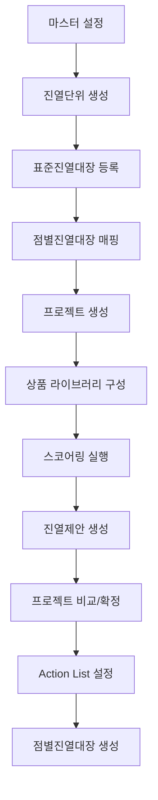
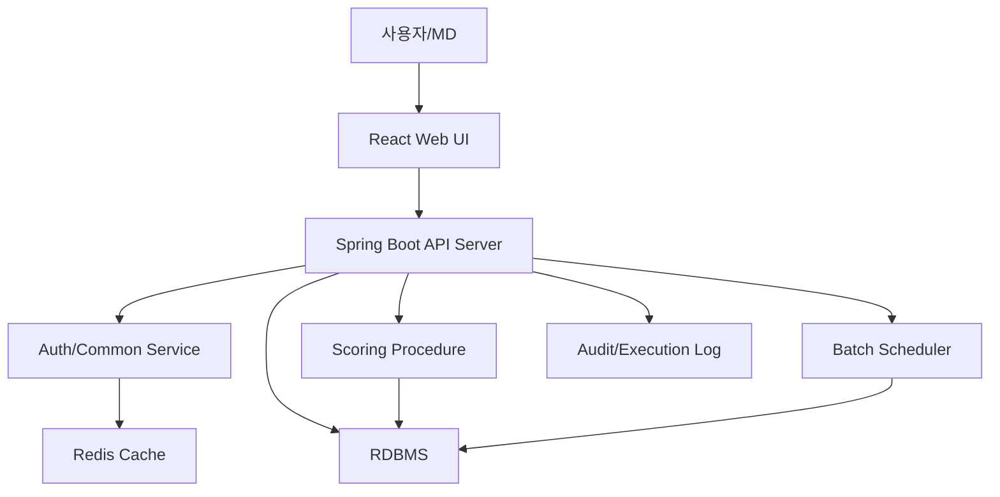

# POG 시스템 메인 설계서

## 1. 목적

본 문서는 POG 시스템을 구성하는 전체 업무 영역과 하위 설계서의 경계를 정의한다.

POG 시스템은 공간 마스터와 진열대장을 기반으로 표준 진열안을 생성하고, 스코어링 및 진열제안 과정을 거쳐 점포별 진열대장을 생성하는 시스템이다. 시스템은 MD가 진열단위별 프로젝트를 생성하고, 지표/가중치/기간/진열 룰을 조정하면서 표준 POG와 점포별 POG를 설계, 비교, 확정할 수 있도록 지원한다.

## 2. 설계 영역

POG 시스템은 다음 4개 영역으로 분리하여 설계한다.

| 영역 | 하위 설계서 | 주요 역할 |
|---|---|---|
| 마스터 설정 | [pog_master_design.md](C:/Projects/pog/pog_master_design.md) | 점, 층, 진열대, 모듈, 선반, 집기, 표준/점별 진열대장, 카테고리, 매핑 관리 |
| 스코어링 | [pog_scoring_design.md](C:/Projects/pog/pog_scoring_design.md) | 상품 라이브러리, 지표 정책, 주별 집계자료, 스코어 산출, 시즌 POG 참조 |
| 진열제안 | [pog_proposal_design.md](C:/Projects/pog/pog_proposal_design.md) | 스코어와 진열대장 속성을 기반으로 상품 위치, 면수, 깊이 등 제안 |
| 점별진열대장 생성 | [pog_store_planogram_design.md](C:/Projects/pog/pog_store_planogram_design.md) | 표준 진열대장과 점별 진열대장 매핑, action list 실행, 점포별 POG 생성 |
| 진열 엔진 아키텍처 | [pog_engine_architecture_design.md](C:/Projects/pog/pog_engine_architecture_design.md) | 표준진열제안 엔진과 점별진열대장 엔진의 시스템/소프트웨어 아키텍처 |

## 3. 전체 업무 흐름



## 4. 핵심 개념

| 개념 | 설명 |
|---|---|
| 공간 마스터 | 점포, 층, 진열대, 모듈 등 물리 공간 구조 |
| 진열대장 | 실제 또는 표준 POG를 표현하는 논리 진열 구조 |
| 표준진열대장 | 진열단위 카테고리 기준으로 생성하는 기준 POG |
| 점별진열대장 | 특정 점포에 적용되는 점포별 POG |
| 진열단위 | POG를 생성하고 평가하는 카테고리 단위. 기본은 중분류 |
| 프로젝트 | 특정 진열단위의 상품 구성, 스코어링, 진열제안을 수행하는 작업 단위 |
| 라이브러리 | 프로젝트에서 스코어링 및 진열제안 대상으로 사용하는 상품 후보군 |
| 진열제안 | 상품별 모듈, 집기, 위치, 면수, 깊이 등 제안 결과 |
| Action List | 표준 POG를 점포별 POG로 변환하기 위한 점포별 실행 옵션 묶음 |

## 5. 시스템 아키텍처

사용자 화면은 웹 기반 React로 구성하고, 서버는 Spring Boot 기반 API 서버로 구성한다. 로그인, 공통코드, 다국어 메시지 등 반복 조회가 많은 공통 데이터는 Redis에 캐싱하여 조회 성능을 확보한다.

스코어링은 화면에서 직접 DB 프로시저를 호출하지 않고, React 화면에서 Spring Boot API를 호출하면 Spring Boot가 권한/파라미터/상태를 검증한 뒤 DB 프로시저를 호출하는 구조를 권장한다.



### 5.1 구성 요소

| 구성 요소 | 기술 | 역할 |
|---|---|---|
| Web UI | React | 마스터 설정, 프로젝트, 스코어링, 진열제안, Action List 실행 화면 |
| API Server | Spring Boot | 화면 API, 권한 검증, 트랜잭션 제어, 프로시저 호출, 실행 이력 저장 |
| RDBMS | PostgreSQL 또는 운영 표준 DB | POG 마스터, 주별 집계, 스코어링 결과, 진열대장, Action List 저장 |
| Redis | Redis | 로그인 세션, 권한 캐시, 공통코드, 다국어 메시지, 화면 설정 캐시 |
| Procedure | DB Stored Procedure | 스코어링, 기간 집계, 일부 대량 계산 처리 |
| Batch | Spring Scheduler, Spring Batch 또는 운영 배치 | 일별/주별 집계, 마이그레이션, 확정 프로젝트 배치 실행 |
| Audit Log | DB Table 또는 로그 저장소 | 사용자 실행, 수동 조정, 프로시저 실행 결과 추적 |

### 5.2 Redis 사용 영역

Redis는 원천 저장소가 아니라 조회 성능 개선을 위한 캐시로 사용한다. 기준 정보의 원본은 DB에 보관하고, 변경 시 캐시를 갱신하거나 무효화한다.

| 캐시 대상 | 설명 |
|---|---|
| 로그인 세션 | 사용자 로그인 상태 및 세션 정보 |
| 권한 정보 | 메뉴/버튼/기능 권한 |
| 공통코드 | 진열대 유형, action 타입, 지표 그룹, 상태 코드 등 |
| 다국어 메시지 | 화면 라벨, 오류 메시지, 도움말 메시지 |
| 화면 설정 | 사용자별 그리드 컬럼, 검색 조건, 최근 작업 |

### 5.3 스코어링 호출 구조

스코어링은 화면에서 생성 버튼을 클릭하면 다음 순서로 처리한다.

```text
React 화면
→ Spring Boot 스코어링 API
→ 프로젝트/라이브러리/정책/권한 검증
→ scoring_run 이력 생성
→ DB 프로시저 호출
→ 지표 기간값, 기준점수, 가중점수 계산
→ 결과 테이블 저장
→ 실행 상태 및 결과 반환
```

프로시저 호출은 반드시 Spring Boot를 경유한다. 이를 통해 사용자 권한, 프로젝트 상태, 중복 실행, 오류 처리, 실행 로그를 일관되게 관리한다.

### 5.4 배치와 온라인 실행

| 구분 | 처리 방식 |
|---|---|
| 일별/주별 집계 | 배치 또는 스케줄러에서 처리 |
| 프로젝트 스코어링 | 화면 요청 기반 API + 프로시저 호출 |
| 진열제안 | 화면 요청 기반 API 처리 |
| Action List 수동 실행 | 화면 요청 기반 단계별 preview/apply |
| 확정 프로젝트 점별 생성 | 수동 실행 또는 배치 실행 |

## 6. 설계 원칙

### 6.1 속성 확장성

진열대, 진열대장, 모듈, 선반, 집기의 속성은 예시로 나열된 항목에 한정하지 않는다. 모든 마스터 객체는 다음 구조를 함께 가진다.

```text
고정 핵심 컬럼 + 확장 속성 정의 + 확장 속성값
```

이를 통해 향후 냉장/냉동, 조명, 도어, 후크, 선반 각도, 전원, 온도대, 계약 위치, 브랜드존, 시야 높이, 법규 제약 등 새로운 속성이 추가되어도 테이블 구조 변경을 최소화한다.

### 6.2 표준과 점별 분리

표준진열대장은 전점 기준 기준안을 의미하고, 점별진열대장은 점포 공간과 판매 특성을 반영한 실행안을 의미한다. 시스템은 표준진열대장과 점별진열대장의 매핑 관계를 유지하고, action list를 통해 표준안을 점포별로 변환한다.

### 6.3 프로젝트 기반 비교

동일 진열단위에 대해 여러 프로젝트를 생성할 수 있다. MD는 프로젝트별 스코어링 지표, 상품 라이브러리, 진열제안 결과를 비교하고 하나의 프로젝트만 확정하여 점별진열대장 생성에 사용한다.

### 6.4 수동 조정 우선

시스템은 스코어링과 진열제안을 통해 객관적인 초안을 제공한다. 신규 상품, 계약 위치 상품, 전략 상품, 시즌 대응 등 정성 판단은 MD 수동 조정과 진열 룰을 통해 반영한다.

### 6.5 재현성과 감사성

스코어링 지표, 가중치, 참조 기간, 상품 라이브러리, 진열제안 결과, 수동 조정, action list 실행 옵션은 모두 이력화한다. 확정 당시의 입력과 정책으로 결과를 재현할 수 있어야 한다.

## 7. 데이터 흐름

```text
마스터 데이터
→ 표준/점별 진열대장
→ 진열단위 프로젝트
→ 상품 라이브러리
→ 주별 집계자료 기반 스코어링
→ 표준 진열제안
→ 확정 프로젝트
→ action list 실행
→ 점별진열대장 생성
```

## 8. 하위 설계서 역할

### 8.1 마스터 설정 설계서

공간 마스터, 점별 진열대장, 표준진열대장, 진열단위, 매핑, 속성 확장 모델을 정의한다.

### 8.2 스코어링 설계서

기존 스코어링 설계 내용을 이동한 문서이다. 주별 집계자료, 지표 그룹 A~E, 가중치, 시즌 POG, 마이그레이션, 스코어 상세 저장 정책을 정의한다.

### 8.3 진열제안 설계서

스코어 결과와 표준진열대장 속성을 기반으로 상품별 진열 위치, 면수, 깊이, 모듈 배치, 계약 위치 반영, 소량 상품 수기 처리, 프로젝트 비교 정책을 정의한다.

### 8.4 점별진열대장 생성 설계서

확정된 표준 프로젝트를 점포별 POG로 변환하는 action list 구조, 실행 방식, 80여 가지 옵션, 사용자 수식, 단계별 실행/미리보기 구조를 정의한다.

## 9. 공통 비기능 요구사항

| 항목 | 요구사항 |
|---|---|
| 확장성 | 지표, 속성, 룰, action 옵션 추가 시 코드 변경 최소화 |
| 재현성 | 과거 프로젝트와 정책 기준으로 동일 결과 재현 가능 |
| 감사성 | 사용자 조정, 룰 적용, action 실행 이력 추적 |
| 성능 | 점포/상품/주차 단위 대량 데이터 집계 및 스코어링 가능 |
| 안정성 | 배치 실패 시 재시도와 이전 확정 결과 유지 |
| 보안 | MD, 운영자, 조회자 권한 분리 |
| 사용성 | 단계별 실행 결과를 화면에서 확인하고 재조정 가능 |
| 캐시 일관성 | 공통코드/다국어 메시지 변경 시 Redis 캐시 갱신 또는 무효화 |
| 실행 통제 | 스코어링 프로시저 호출은 API 서버를 통해 권한과 상태 검증 후 실행 |

## 10. 문서 목록

- [마스터 설정 설계서](C:/Projects/pog/pog_master_design.md)
- [스코어링 설계서](C:/Projects/pog/pog_scoring_design.md)
- [진열제안 설계서](C:/Projects/pog/pog_proposal_design.md)
- [점별진열대장 생성 설계서](C:/Projects/pog/pog_store_planogram_design.md)
- [진열 엔진 아키텍처 설계서](C:/Projects/pog/pog_engine_architecture_design.md)
