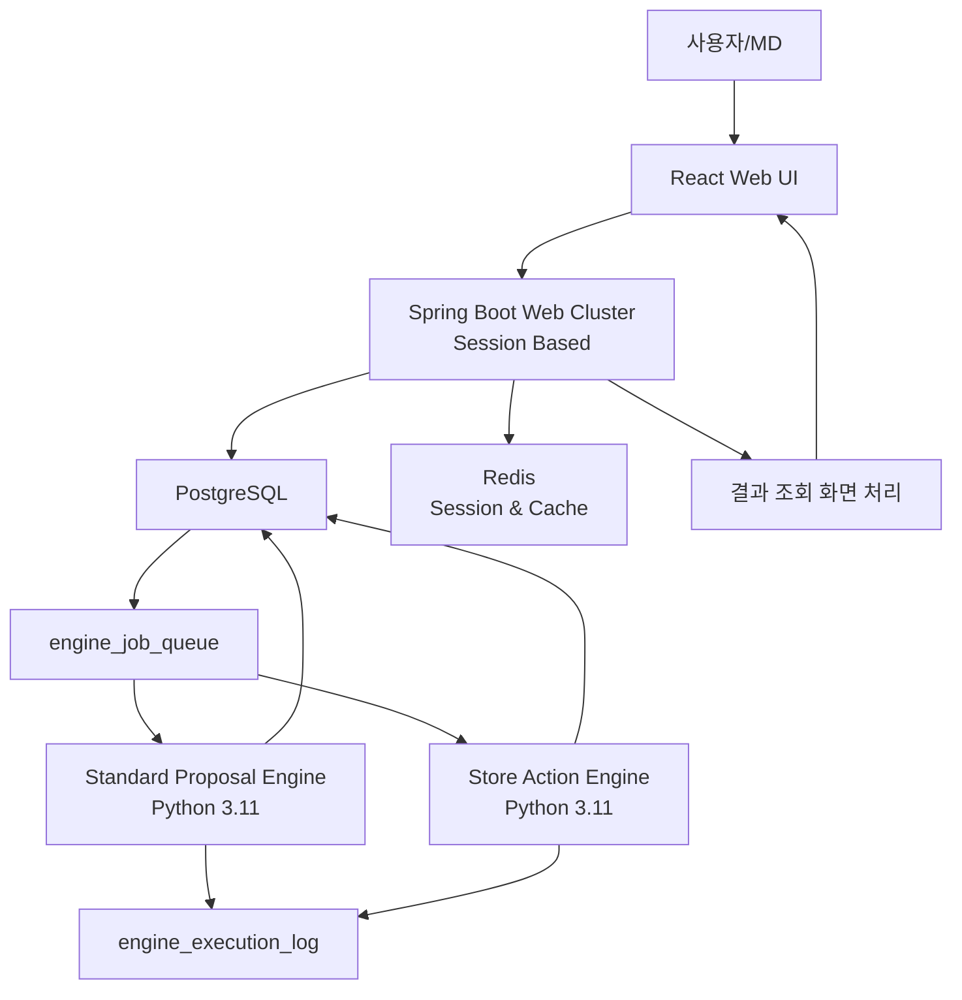

# POG 진열 엔진 아키텍처 설계서

## 1. 목적

본 문서는 표준진열제안 엔진과 점별진열대장 생성 엔진의 시스템 아키텍처와 소프트웨어 아키텍처를 정의한다.

두 엔진은 모두 Python 3.11 기준으로 설계하며, PostgreSQL을 중심 저장소로 사용한다. React 화면은 세션 기반 Spring Boot 웹 서버 클러스터의 화면 액션을 호출하고, Spring Boot는 PostgreSQL job 테이블에 실행 요청을 등록한다. Python 엔진은 job을 polling 또는 notify 방식으로 가져와 실시간 배치 형태로 처리한다.

## 2. 설계 판단

### 2.1 Procedure 방식과 Python 엔진 방식 비교

| 구분 | DB Procedure 방식 | Python 엔진 방식 |
|---|---|---|
| 적합 업무 | 정형 집계, 스코어링, 대량 update | 배치 탐색, 룰 평가, 위치 계산, 미리보기, rollback |
| 장점 | DB 내부 처리로 빠름, 배포 단순 | 복잡한 알고리즘 구현 용이, 테스트 용이, 모듈화 가능 |
| 단점 | 복잡한 룰/공간 계산 유지보수 어려움 | 별도 실행 환경과 job 관리 필요 |
| 화면 연동 | Spring Boot 화면 Controller에서 procedure 호출 | 화면 액션은 Spring Boot를 경유하고, 엔진은 DB job 기반 비동기 처리 |

표준진열제안과 점별진열대장 생성은 상품, 표준진열대장, 모듈, 선반, 집기, 속성, 스코어, 룰, 사용자 수식, 공간 제약을 함께 판단해야 한다. 따라서 DB procedure보다는 Python 3.11 기반 엔진으로 구현하는 것이 더 적합하다.

스코어링처럼 지표 기간 집계와 기준점수 산출이 중심인 작업은 기존 설계처럼 DB procedure를 사용할 수 있다. 단, 표준진열제안과 점별진열대장 생성은 Python 엔진을 기본안으로 한다.

## 3. 전체 시스템 아키텍처



## 4. 엔진 분리 원칙

| 엔진 | 사용 영역 | Action List 사용 여부 |
|---|---|---|
| Standard Proposal Engine | 표준진열제안 생성 | 사용하지 않음 |
| Store Action Engine | 점별진열대장 생성 | 사용함 |

Action List는 점별진열대장 생성 전용이다. 표준진열제안 엔진은 Action List를 참조하지 않고, 스코어링 결과와 표준진열대장/상품/속성/제약 룰만 사용한다.

## 5. 표준진열제안 엔진

### 5.1 역할

표준진열제안 엔진은 프로젝트의 상품 라이브러리와 스코어링 결과, 표준진열대장 구조, 상품/집기/모듈/선반 속성을 기반으로 상품별 모듈, 선반, 집기, 위치, 면수, 진열 깊이를 제안한다.

### 5.2 입력 데이터

| 데이터 | 설명 |
|---|---|
| 프로젝트 | 진열단위, 대상 표준진열대장, 상태 |
| 상품 라이브러리 | 제안 대상 상품 목록 |
| 스코어링 결과 | 상품별 최종 스코어와 지표별 상세 점수 |
| 표준진열대장 | 모듈, 선반, 집기 구조 |
| 확장 속성 | 상품, 모듈, 선반, 집기, 진열대장의 속성 |
| 표준 제안 룰 | 계약 위치, 필수 포함, 제외, 신상품 처리 등 |

### 5.3 처리 흐름

```text
1. proposal job 조회
2. 프로젝트와 라이브러리 로딩
3. 스코어링 결과 로딩
4. 표준진열대장 구조와 확장 속성 로딩
5. 제안 컨텍스트 생성
6. 계약 위치/필수/제외 룰 선반영
7. 상품별 권장 면수와 깊이 산정
8. 모듈/선반/집기 위치 후보 생성
9. 공간 제약 검증
10. 제안 결과와 사유 저장
11. job 상태 갱신
```

### 5.4 내부 컴포넌트

| 컴포넌트 | 역할 |
|---|---|
| JobRunner | PostgreSQL job 수신 및 실행 상태 관리 |
| ContextBuilder | 프로젝트, 상품, 스코어, 진열대장, 속성을 엔진 컨텍스트로 구성 |
| AttributeResolver | 화면 표시명과 확장 속성을 엔진 내부 필드로 변환 |
| StandardRuleEvaluator | 표준 제안 룰 평가 |
| FacingAllocator | 스코어와 공간 기준으로 면수/깊이 산정 |
| PlacementPlanner | 모듈/선반/집기 위치 후보 생성 |
| ConstraintValidator | 폭, 높이, 깊이, 용량, 온도대, 충돌 제약 검증 |
| ProposalWriter | 제안 결과와 적용 사유 저장 |

## 6. 점별진열대장 생성 엔진

### 6.1 역할

점별진열대장 생성 엔진은 확정된 표준진열제안 결과를 점포별 공간에 맞게 변환한다. 이때 표준/점별 진열대장 매핑, 점포 공간 마스터, 점포별 속성, Action List JSON, 사용자 수식을 사용한다.

### 6.2 입력 데이터

| 데이터 | 설명 |
|---|---|
| 확정 프로젝트 | 점별 생성 대상 프로젝트 |
| 표준진열제안 결과 | 상품별 표준 위치, 면수, 깊이 |
| 표준/점별 매핑 | 표준진열대장과 점별진열대장 연결 |
| 점포 공간 마스터 | 점포, 층, 진열대, 모듈, 선반, 집기 |
| Action List JSON | 설정/공간 전처리/상품 후보/위치 후보/그룹 준비/상품 배열 실행/최종 확정 단계, key1 단위 명령과 옵션 |
| 사용자 수식 | Action 단계별 조건/집계/필터/랭킹 수식 |
| 점포별 집계 지표 | 매출, 재고, 취급 여부 등 점포 특성 |

### 6.3 처리 흐름

```text
1. store planogram job 조회
2. 확정 프로젝트와 표준진열제안 결과 로딩
3. 대상 점포와 표준/점별 진열대장 매핑 로딩
4. Action List JSON 로딩
5. 설정 단계, 공간 전처리 단계, 후보 준비 단계, 상품 배열 실행 단계, 최종 확정 단계 분리
6. key1 단위 실행 계획 생성
7. common 명령 여부와 실제 등록 단계 해석
8. 사용자 수식 검증 및 AST 변환
9. 설정/공간/상품/위치/그룹 준비 단계 값을 실행 컨텍스트에 반영
10. Reduce to Fit 이후 상품 배열 실행 단계별 preview 또는 apply 실행
11. 점포별 공간 부족/초과 처리
12. 점별진열대장 item 저장
13. 실행 로그와 변경 전/후 값 저장
```

### 6.4 내부 컴포넌트

| 컴포넌트 | 역할 |
|---|---|
| JobRunner | 점별 생성 job 수신 및 실행 상태 관리 |
| ActionListLoader | Action List JSON과 명령 카탈로그 로딩 |
| ActionPlanner | phaseType, phase, key1, common 명령 여부 기준 실행 계획 생성 |
| FormulaParser | 사용자 수식 토큰화, AST 생성, 검증 |
| FormulaEvaluator | 허용된 함수와 필드만 사용해 수식 평가 |
| StoreContextBuilder | 점포 공간, 점별 속성, 표준 제안 결과를 컨텍스트로 구성 |
| ActionExecutor | key1 단위 명령 실행 |
| StoreFitEngine | 부족/초과/방향/브랜드 모음/위치 고정 등 점포별 변환 처리 |
| PreviewManager | 단계별 미리보기와 rollback snapshot 관리 |
| StorePlanogramWriter | 점별진열대장 결과 저장 |

## 7. PostgreSQL Job 기반 실행 구조

### 7.1 실행 요청

React 화면에서 사용자가 표준진열제안 또는 점별진열대장 생성을 요청하면 세션 기반 Spring Boot 화면 Controller가 job을 생성한다.

```text
React
→ Spring Boot 화면 Controller
→ 세션/권한/상태/파라미터 검증
→ engine_job_queue insert
→ Python engine 실행
→ 결과 저장
→ 화면에서 job 상태 polling
```

### 7.2 engine_job_queue

| 컬럼 | 설명 |
|---|---|
| job_id | Job ID |
| engine_type | STANDARD_PROPOSAL / STORE_ACTION |
| request_type | PREVIEW / APPLY / BATCH |
| project_id | 프로젝트 ID |
| proposal_id | 표준진열제안 ID |
| action_list_id | Action List ID |
| target_store_id | 대상 점포 |
| request_payload_json | 실행 요청 JSON |
| status | READY / RUNNING / SUCCESS / FAILED / CANCELED |
| priority | 실행 우선순위 |
| requested_by | 요청자 |
| requested_at | 요청일시 |
| started_at | 시작일시 |
| ended_at | 종료일시 |
| error_message | 오류 메시지 |

### 7.3 engine_execution_log

| 컬럼 | 설명 |
|---|---|
| log_id | 로그 ID |
| job_id | Job ID |
| engine_type | 엔진 유형 |
| step_name | 실행 단계 |
| log_level | INFO / WARN / ERROR |
| message | 메시지 |
| detail_json | 상세 정보 |
| created_at | 생성일시 |

### 7.4 engine_result_snapshot

미리보기와 rollback을 위해 실행 전/후 결과를 snapshot으로 저장한다.

| 컬럼 | 설명 |
|---|---|
| snapshot_id | Snapshot ID |
| job_id | Job ID |
| target_type | PROPOSAL / STORE_PLANOGRAM |
| target_id | 대상 ID |
| snapshot_type | BEFORE / AFTER |
| snapshot_json | 결과 JSON |
| created_at | 생성일시 |

## 8. Spring Boot 세션 기반 웹 서버 연동 원칙

Spring Boot는 엔진 로직을 직접 수행하지 않고, 다음 역할을 담당한다.

- 클러스터 환경의 사용자 세션 유지
- 사용자 인증/인가
- 프로젝트 상태 검증
- 실행 요청 중복 방지
- job 생성
- job 상태 조회 화면 처리
- 결과 조회 화면 처리
- Redis 세션/캐시 조회
- 실행 취소 또는 rollback 요청

표준진열제안과 점별진열대장 생성의 실제 계산은 Python 엔진에서 수행한다.

## 9. Redis 사용

Redis는 Python 엔진과 Spring Boot가 공통으로 참조할 수 있는 캐시 계층으로 사용한다.

| 캐시 대상 | 사용 주체 | 설명 |
|---|---|---|
| 공통코드 | Spring Boot, Python | 단계 코드, 명령 타입, 상태 코드 |
| 클러스터 세션 | Spring Boot | 서버 간 사용자 세션 공유 |
| 로그인 컨텍스트 | Spring Boot | 로그인 사용자와 현재 권한 범위 |
| 다국어 메시지 | Spring Boot | 화면 메시지 |
| 필드 사전 | Python | 사용자 수식 필드명과 DB 컬럼 매핑 |
| 속성 메타데이터 | Python | 확장 속성 정의 캐시 |
| 사용자 권한 | Spring Boot | 화면/기능 권한 |

Python 엔진은 Redis 장애 시 DB 원본을 조회할 수 있어야 한다. Redis는 원천 저장소가 아니라 성능 향상을 위한 캐시이다.

## 10. Python 소프트웨어 아키텍처

### 10.1 공통 폴더 구조

```text
pog-engines/
  pyproject.toml
  README.md
  .env.example
  src/
    pog_engines/
      __init__.py
      main.py
      config/
        settings.py
        logging.py
      db/
        connection.py
        transaction.py
        repositories/
          job_repository.py
          project_repository.py
          planogram_repository.py
          product_repository.py
          score_repository.py
          attribute_repository.py
          proposal_repository.py
          action_repository.py
      common/
        models.py
        enums.py
        errors.py
        json_utils.py
        unit_converter.py
      metadata/
        field_dictionary.py
        attribute_dictionary.py
        command_dictionary.py
      formula/
        tokenizer.py
        parser.py
        ast.py
        validator.py
        evaluator.py
        functions.py
      jobs/
        dispatcher.py
        worker.py
        scheduler.py
        heartbeat.py
      standard_proposal/
        context_builder.py
        rule_evaluator.py
        facing_allocator.py
        placement_planner.py
        constraint_validator.py
        proposal_writer.py
        service.py
      store_action/
        action_list_loader.py
        action_planner.py
        action_executor.py
        store_context_builder.py
        store_fit_engine.py
        preview_manager.py
        store_planogram_writer.py
        service.py
      observability/
        metrics.py
        trace.py
        audit_logger.py
  tests/
    unit/
    integration/
    fixtures/
```

### 10.2 실행 진입점

```text
python -m pog_engines.main --engine standard-proposal
python -m pog_engines.main --engine store-action
python -m pog_engines.main --engine all
```

운영 환경에서는 엔진을 별도 프로세스로 실행할 수 있다.

```text
standard-proposal-worker
store-action-worker
```

## 11. 오픈소스 라이브러리 구성

표준진열제안 엔진과 점별진열대장 엔진은 Python 3.11 기반으로 구현하며, PostgreSQL을 중심 저장소로 사용한다. 라이브러리는 엔진의 책임별로 구분하여 적용한다.

### 11.1 핵심 권장 라이브러리

버전 기준은 2026년 9월 6일 PyPI 기준으로 작성한다. 실행 환경은 Python 3.11이므로 Python 3.11을 지원하지 않는 최신 버전은 제외하고, 운영 안정성을 위해 메이저 또는 마이너 상한을 둔다.

| 영역 | 라이브러리 | 적용 엔진 | 용도 | 권장 수준 |
|---|---|---|---|---|
| PostgreSQL 연결 | `psycopg[binary,pool]` | 공통 | PostgreSQL 접속, connection pool, transaction, `FOR UPDATE SKIP LOCKED`, COPY, 비동기 지원 | 필수 |
| SQL 구성 | `SQLAlchemy Core` | 공통 | 복잡한 조회 SQL 구성, repository 계층 표준화 | 권장 |
| 데이터 검증 | `pydantic` | 공통 | job payload, Action List JSON, 엔진 컨텍스트, 설정값 검증 | 필수 |
| 고속 JSON | `orjson` | 공통 | job payload, snapshot, option_json 직렬화/역직렬화 | 권장 |
| 수식 파싱 | `lark` | Store Action | 사용자 수식 DSL 파싱, AST 생성 | 필수 |
| 수치 계산 | `numpy` | 공통 | 면수/깊이 계산, 배열 기반 수치 처리 | 권장 |
| 데이터프레임 | `polars` | 공통 | 상품/스코어/속성/점포별 집계 데이터 필터링과 그룹 연산 | 권장 |
| 공간 연산 | `shapely` | 공통 | 진열 영역, 상품 bounding box, 충돌/포함/겹침 검증 | 권장 |
| 최적화 | `ortools` | Standard Proposal | 제약 기반 배치 최적화, 공간 배분, 상품-위치 할당 | 권장 |
| 그래프/그룹 | `networkx` | Store Action | 세그먼트 연결, fixture linkage, 브랜드/카테고리 grouping 관계 계산 | 선택 |
| 재시도 | `tenacity` | 공통 | DB 일시 장애, Redis 일시 장애, job 점유 재시도 | 권장 |
| Redis | `redis` | 공통 | 공통코드, 필드 사전, 속성 메타데이터 캐시 조회 | 권장 |
| 설정 | `pydantic-settings` | 공통 | 환경변수 기반 설정 로딩 | 권장 |
| 로깅 | `structlog` | 공통 | job_id, project_id, store_id 포함 구조화 로그 | 권장 |
| 메트릭 | `prometheus-client` | 공통 | job 처리 시간, 성공/실패 건수, queue depth 메트릭 | 권장 |
| 분산 추적 | `opentelemetry-api`, `opentelemetry-sdk` | 공통 | Spring Boot 화면 서버와 Python worker 간 trace 연계 | 선택 |
| 테스트 | `pytest` | 공통 | 단위/통합 테스트 | 필수 |
| 속성 기반 테스트 | `hypothesis` | 공통 | 수식 파서, 공간 배치, 경계값 테스트 | 권장 |
| 테스트 DB | `testcontainers[postgresql]` | 공통 | PostgreSQL 통합 테스트 컨테이너 | 권장 |
| 코드 품질 | `ruff`, `mypy` | 공통 | lint, format, 타입 검사 | 권장 |

### 11.2 권장 버전

| 라이브러리 | 권장 버전 범위 | 기준 버전 | 비고 |
|---|---|---|---|
| Python | `==3.11.*` | 3.11 | 엔진 표준 런타임 |
| `psycopg[binary,pool]` | `>=3.3.5,<3.4` | 3.3.5 | Python 3.10+ 지원, PostgreSQL adapter |
| `SQLAlchemy` | `>=2.0.52,<2.1` | 2.0.52 | Core 중심 사용 |
| `pydantic` | `>=2.13.5,<2.14` | 2.13.5 | payload/context 검증 |
| `pydantic-settings` | `>=2.15.0,<2.16` | 2.15.0 | 환경 설정 |
| `orjson` | `>=3.12.0,<3.13` | 3.12.0 | 고속 JSON |
| `lark` | `>=1.3.1,<1.4` | 1.3.1 | 사용자 수식 DSL 파서 |
| `numpy` | `>=2.4.6,<2.5` | 2.4.6 | Python 3.11 호환 최신 라인. 2.5.x는 Python 3.12+ 기준이라 제외 |
| `polars` | `>=1.44.1,<1.45` | 1.44.1 | 대량 데이터프레임 처리 |
| `shapely` | `>=2.1.2,<2.2` | 2.1.2 | 공간 연산 |
| `ortools` | `>=9.15.6755,<9.16` | 9.15.6755 | 제약 최적화 |
| `networkx` | `>=3.6.1,<3.7` | 3.6.1 | 그래프/연결 관계 |
| `redis` | `>=8.1.0,<8.2` | 8.1.0 | Redis client |
| `tenacity` | `>=9.1.4,<9.2` | 9.1.4 | 재시도 |
| `structlog` | `>=26.1.0,<26.2` | 26.1.0 | 구조화 로그 |
| `prometheus-client` | `>=0.26.0,<0.27` | 0.26.0 | 메트릭 |
| `opentelemetry-api` | `>=1.44.0,<1.45` | 1.44.0 | trace API |
| `opentelemetry-sdk` | `>=1.44.0,<1.45` | 1.44.0 | trace SDK |
| `pytest` | `>=9.1.1,<9.2` | 9.1.1 | 테스트 |
| `hypothesis` | `>=6.167.1,<6.168` | 6.167.1 | 속성 기반 테스트 |
| `testcontainers[postgresql]` | `>=4.15.0,<4.16` | 4.15.0 | PostgreSQL 통합 테스트 |
| `ruff` | `>=0.16.6,<0.17` | 0.16.6 | lint/format |
| `mypy` | `>=2.3.1,<2.4` | 2.3.1 | 타입 검사 |

운영 배포에서는 위 범위를 그대로 사용하되, 실제 배포 시점에는 `uv.lock` 또는 `requirements.lock`으로 transitive dependency까지 잠근다. 개발 초기에는 마이너 업데이트를 허용하고, 운영 반영 전에는 테스트 통과 버전을 lock 파일로 고정한다.

### 11.3 표준진열제안 엔진 적용 라이브러리

표준진열제안 엔진은 Action List를 사용하지 않는다. 상품 스코어, 표준진열대장 구조, 모듈/선반/집기/상품 속성을 이용해 최적 진열안을 제안한다.

| 처리 | 권장 라이브러리 | 설명 |
|---|---|---|
| 컨텍스트 로딩 | `psycopg`, `SQLAlchemy Core`, `pydantic` | 프로젝트, 라이브러리, 스코어, 진열대장, 확장 속성 조회와 검증 |
| 데이터 전처리 | `polars`, `numpy` | 상품 후보 정렬, 그룹 집계, 스코어 기반 면수 산정 |
| 공간 모델링 | `shapely` | 선반/집기/상품의 2D 영역 표현, 겹침과 포함 여부 계산 |
| 위치 최적화 | `ortools` | 상품-위치 할당, 면수 배분, 공간 제약 기반 최적화 |
| 단순 초기안 | Python 표준 라이브러리, `numpy` | OR-Tools 적용 전 기본 휴리스틱 배치 |
| 결과 저장 | `psycopg`, `orjson` | 제안 결과, 적용 사유, snapshot 저장 |

표준진열제안 엔진의 기본 전략은 다음과 같다.

```text
1차: 규칙 기반 휴리스틱으로 빠른 배치 후보 생성
2차: OR-Tools로 공간/면수/위치 제약을 만족하는 후보 최적화
3차: Shapely로 최종 겹침/포함/충돌 검증
```

OR-Tools는 모든 케이스에 무조건 사용하지 않는다. 상품 수가 적거나 제약이 단순한 경우에는 휴리스틱 결과를 그대로 사용할 수 있고, 상품 수가 많거나 계약 위치, 필수 진열, 공간 부족이 복잡한 경우에 최적화 모델을 적용한다.

### 11.4 점별진열대장 엔진 적용 라이브러리

점별진열대장 엔진은 Action List JSON과 사용자 수식을 사용한다. Action List 단계는 `SETTING`, `SPACE_PREP`, `PRODUCT_PREP`, `POSITION_PREP`, `GROUP_PREP`, `ARRANGE_EXECUTION`, `FINALIZE`로 구분하고, 실행 단위는 `key1`이다. `SETTING`부터 `GROUP_PREP`까지는 실제 상품 배열 확정 전 준비 단계이며, `ARRANGE_EXECUTION`과 `FINALIZE`는 실제 점별진열대장 상품 구성, 위치, 면수, 깊이, 배치 결과를 변경하거나 확정한다. `common` 명령은 독립 단계가 아니라 공통 명령 카탈로그 분류이며, 실제 JSON에서는 사용자가 선택한 단계 아래의 `key1`로 등록된다.

| 처리 | 권장 라이브러리 | 설명 |
|---|---|---|
| Action List JSON 검증 | `pydantic`, `orjson` | phaseType과 key1 설정 화면 단위 JSON payload 검증 |
| 명령 실행 계획 | Python 표준 라이브러리, `networkx` | phaseType/phase/key1/common 명령 여부 해석, fixture linkage와 후보/배열 실행 순서 처리 |
| 사용자 수식 파싱 | `lark` | `IF`, `CONTAINS`, `SUM`, `COUNT_UNIQUE`, `RANK_BY`, `CUME` 등 DSL 파싱 |
| 수식 평가 | `polars`, `numpy` | 필터, 집계, 랭킹, 누적 구성비 계산 |
| 공간 검증 | `shapely` | 상품 이동 후 위치 겹침, 집기 영역 초과, 선반 포함 여부 검증 |
| 실행/rollback | `psycopg`, `orjson` | 단계별 before/after snapshot 저장 |
| 로그/추적 | `structlog`, `prometheus-client` | action step별 처리 결과, 실패 원인, 소요 시간 기록 |

점별진열대장 엔진에서 `lark`는 사용자 입력 수식을 SQL로 직접 변환하기 위한 도구가 아니라, 허용된 DSL만 파싱하고 검증하기 위한 도구이다. 실제 평가는 엔진 내부 evaluator가 허용된 함수와 필드만 대상으로 수행한다.

### 11.5 Job 실행 방식과 라이브러리 선택

본 설계의 기본 job queue는 PostgreSQL 테이블이다. 따라서 Python worker는 `psycopg`로 job을 점유하고 상태를 갱신한다.

```sql
SELECT job_id
FROM engine_job_queue
WHERE status = 'READY'
ORDER BY priority DESC, requested_at
FOR UPDATE SKIP LOCKED
LIMIT 1;
```

Redis 기반 job queue 라이브러리인 `RQ` 또는 `Celery`는 기본안에 포함하지 않는다. 이미 Spring Boot와 PostgreSQL이 실행 요청의 원장 역할을 하므로, Redis queue를 추가하면 운영 구성요소가 늘어난다. 다만 향후 대규모 worker 확장이나 예약/재시도 정책이 복잡해지면 `Celery` 또는 `RQ` 도입을 재검토할 수 있다.

### 11.6 pyproject.toml 예시

```toml
[project]
name = "pog-engines"
requires-python = ">=3.11"
dependencies = [
  "psycopg[binary,pool]>=3.3.5,<3.4",
  "SQLAlchemy>=2.0.52,<2.1",
  "pydantic>=2.13.5,<2.14",
  "pydantic-settings>=2.15.0,<2.16",
  "orjson>=3.12.0,<3.13",
  "lark>=1.3.1,<1.4",
  "numpy>=2.4.6,<2.5",
  "polars>=1.44.1,<1.45",
  "shapely>=2.1.2,<2.2",
  "ortools>=9.15.6755,<9.16",
  "networkx>=3.6.1,<3.7",
  "redis>=8.1.0,<8.2",
  "tenacity>=9.1.4,<9.2",
  "structlog>=26.1.0,<26.2",
  "prometheus-client>=0.26.0,<0.27",
  "opentelemetry-api>=1.44.0,<1.45",
  "opentelemetry-sdk>=1.44.0,<1.45"
]

[dependency-groups]
dev = [
  "pytest>=9.1.1,<9.2",
  "hypothesis>=6.167.1,<6.168",
  "testcontainers[postgresql]>=4.15.0,<4.16",
  "ruff>=0.16.6,<0.17",
  "mypy>=2.3.1,<2.4"
]
```

### 11.7 라이브러리 적용 원칙

- `psycopg`는 PostgreSQL job queue와 결과 저장의 기본 DB adapter로 사용한다.
- `SQLAlchemy`는 ORM 전체 도입보다 Core 중심으로 사용하여 SQL 통제력을 유지한다.
- `pydantic`은 외부 입력, job payload, Action List JSON, 엔진 컨텍스트 검증에 사용한다.
- `lark`는 사용자 수식 DSL의 grammar와 AST 생성을 담당한다.
- `polars`는 대량 상품/스코어/속성 데이터의 필터링과 집계에 사용한다.
- `shapely`는 실제 진열 영역의 충돌, 포함, 교차 검증에 사용한다.
- `ortools`는 복잡한 공간 배치와 상품-위치 할당 문제에 선택적으로 적용한다.
- `networkx`는 fixture linkage, segment association, 그룹 연결 관계처럼 그래프 구조가 필요한 경우에만 사용한다.
- `Redis`는 원천 저장소가 아니라 필드 사전, 공통코드, 속성 메타데이터 캐시로 사용한다.
- 테스트는 수식 파서, 공간 배치, 제약 검증, PostgreSQL job 점유 로직을 중심으로 작성한다.

## 12. 표준진열제안 엔진 폴더 책임

| 폴더/파일 | 책임 |
|---|---|
| `standard_proposal/context_builder.py` | 표준진열제안 입력 컨텍스트 생성 |
| `standard_proposal/rule_evaluator.py` | 표준 제안 룰 평가 |
| `standard_proposal/facing_allocator.py` | 상품별 면수와 깊이 산정 |
| `standard_proposal/placement_planner.py` | 모듈/선반/집기 위치 후보 생성 |
| `standard_proposal/constraint_validator.py` | 공간/속성/충돌 제약 검증 |
| `standard_proposal/proposal_writer.py` | 제안 결과 저장 |
| `standard_proposal/service.py` | 엔진 실행 흐름 조합 |

## 13. 점별진열대장 엔진 폴더 책임

| 폴더/파일 | 책임 |
|---|---|
| `store_action/action_list_loader.py` | Action List JSON과 명령 정의 로딩 |
| `store_action/action_planner.py` | phaseType, key1, common 명령 여부 기준 실행 계획 생성 |
| `store_action/action_executor.py` | key1 단위 명령 실행 |
| `store_action/store_context_builder.py` | 점포별 공간/상품/표준제안 컨텍스트 생성 |
| `store_action/store_fit_engine.py` | 부족/초과/방향/브랜드 모음 등 점별 변환 |
| `store_action/preview_manager.py` | preview, apply, rollback snapshot 관리 |
| `store_action/store_planogram_writer.py` | 점별진열대장 결과 저장 |
| `store_action/service.py` | 엔진 실행 흐름 조합 |

## 14. 트랜잭션과 동시성

- job은 `READY` 상태에서 하나의 worker만 점유할 수 있어야 한다.
- PostgreSQL의 `FOR UPDATE SKIP LOCKED` 방식으로 worker 간 중복 실행을 방지한다.
- 표준진열제안 결과 저장은 job 단위 트랜잭션으로 처리한다.
- 점별진열대장 생성은 점포 단위 또는 action step 단위 트랜잭션으로 분리할 수 있다.
- preview 실행은 실제 확정 테이블을 직접 변경하지 않고 snapshot 또는 임시 결과 테이블에 저장한다.
- apply 실행만 확정 결과 테이블에 반영한다.

## 15. 오류 처리

| 오류 | 처리 |
|---|---|
| 입력 데이터 없음 | job 실패 처리 및 누락 데이터 메시지 저장 |
| 속성 매핑 실패 | 해당 필드와 객체 정보를 로그에 기록 |
| 수식 검증 실패 | 실행 전 중단, 오류 위치 반환 |
| 공간 부족 | 미배정/초과 상품으로 분리하고 사유 저장 |
| worker 장애 | RUNNING timeout 감지 후 재시도 또는 FAILED 처리 |
| DB 장애 | 트랜잭션 rollback 후 job 상태 유지 또는 실패 처리 |

## 16. 최종 권장안

표준진열제안과 점별진열대장 생성은 Python 3.11 기반 엔진으로 구현한다. Spring Boot는 세션 기반 화면 처리와 job 제어를 담당하고, PostgreSQL은 job queue와 결과 저장소 역할을 한다.

권장 구조:

```text
React
→ Spring Boot Web Cluster
→ PostgreSQL job queue
→ Python 3.11 engine
→ PostgreSQL result tables
→ Spring Boot result screen handler
→ React
```

이 구조는 복잡한 진열 계산을 UI와 Spring Boot 화면 서버에서 분리하고, 세션 기반 화면 UX와 비동기 배치 실행을 모두 지원할 수 있다.
