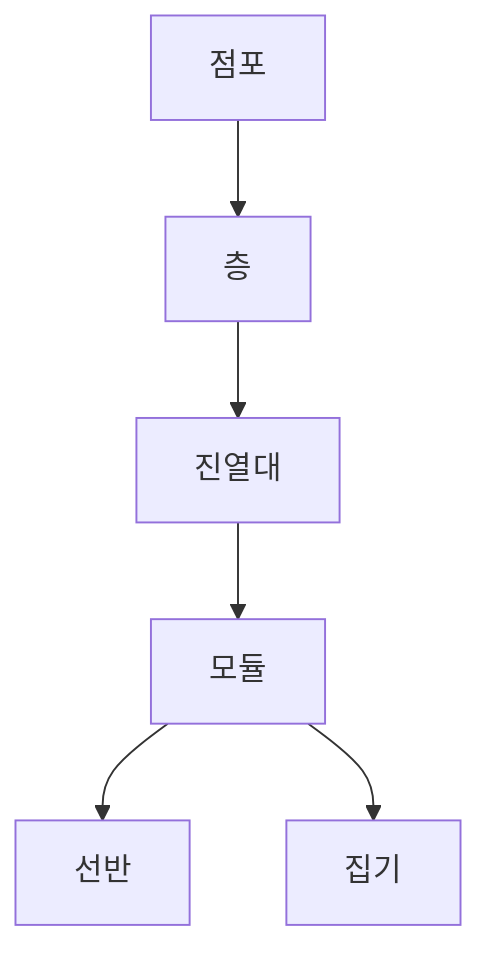

# POG 마스터 설정 설계서

## 1. 목적

본 문서는 POG 시스템의 마스터 설정 영역을 정의한다. 마스터 설정은 점포 공간 구조, 점별 진열대장, 표준진열대장, 진열단위 카테고리, 표준/점별 매핑, 모듈/선반/집기 속성 관리를 담당한다.

진열대, 진열대장, 모듈, 선반, 집기의 속성은 예시 항목으로 제한하지 않는다. 시스템은 확장 속성 구조를 제공하여 신규 속성, 신규 집기 유형, 신규 진열 룰이 추가되어도 유연하게 대응한다.

## 2. 업무 범위

| 구분 | 설명 |
|---|---|
| 공간 마스터 | 점 > 층 > 진열대 > 모듈 구조 관리 |
| 점별 진열대장 | 점포별 실제 진열대장을 등록하고 공간 마스터 진열대와 매핑 |
| 표준진열대장 | 진열단위별 기준 진열대장 생성 |
| 구성 요소 | 진열대장은 모듈과 선반으로 구성하고 각 요소의 속성을 설정 |
| 진열단위 | 중분류 기준 진열단위 카테고리 생성 |
| 매핑 | 점별진열대장과 표준진열대장 매핑 |
| 속성 확장 | 객체별 확장 속성 정의 및 값 관리 |

## 3. 공간 마스터 구조

공간 마스터는 실제 점포의 물리 공간을 표현한다. 점별 진열대장은 공간 마스터의 진열대 또는 모듈에 매핑되어 실제 적용 위치를 가진다.

## 4. 핵심 엔티티

### 4.1 store

| 컬럼 | 설명 |
|---|---|
| store_id | 점포 코드 |
| store_name | 점포명 |
| store_type | 점포 유형 |
| region_code | 권역 |
| sales_area | 매장 면적 |
| status | 운영 상태 |

### 4.2 store_floor

| 컬럼 | 설명 |
|---|---|
| floor_id | 층 ID |
| store_id | 점포 코드 |
| floor_name | 층명 |
| floor_order | 층 순서 |
| use_yn | 사용 여부 |

### 4.3 store_fixture

공간 마스터의 물리 진열대.

| 컬럼 | 설명 |
|---|---|
| fixture_id | 진열대 ID |
| store_id | 점포 코드 |
| floor_id | 층 ID |
| fixture_code | 점포 내 진열대 코드 |
| fixture_name | 진열대명 |
| fixture_type | 진열대 유형 |
| width | 폭 |
| height | 높이 |
| depth | 깊이 |
| x_position | 평면도 X 좌표 |
| y_position | 평면도 Y 좌표 |
| direction | 진열 방향 |
| use_yn | 사용 여부 |

### 4.4 fixture_module

| 컬럼 | 설명 |
|---|---|
| module_id | 모듈 ID |
| fixture_id | 진열대 ID |
| module_no | 모듈 번호 |
| width | 폭 |
| height | 높이 |
| depth | 깊이 |
| start_x | 진열대 내 시작 위치 |
| end_x | 진열대 내 종료 위치 |
| use_yn | 사용 여부 |

### 4.5 module_shelf

| 컬럼 | 설명 |
|---|---|
| shelf_id | 선반 ID |
| module_id | 모듈 ID |
| shelf_no | 선반 번호 |
| shelf_type | 선반 유형 |
| width | 폭 |
| height | 높이 |
| depth | 깊이 |
| vertical_position | 세로 위치 |
| max_weight | 허용 중량 |
| use_yn | 사용 여부 |

### 4.6 display_equipment

집기는 선반, 후크, 바스켓, 냉장/냉동 도어, 행거, 엔드, 팔레트 등 상품 진열에 직접 영향을 주는 구성 요소이다.

| 컬럼 | 설명 |
|---|---|
| equipment_id | 집기 ID |
| module_id | 모듈 ID |
| shelf_id | 선반 ID |
| equipment_type | 집기 유형 |
| equipment_name | 집기명 |
| width | 폭 |
| height | 높이 |
| depth | 깊이 |
| capacity_rule | 수용량 산정 방식 |
| use_yn | 사용 여부 |

## 5. 진열대장 구조

진열대장은 표준진열대장과 점별진열대장으로 분리한다.

| 구분 | 설명 |
|---|---|
| 표준진열대장 | 진열단위 카테고리 기준으로 생성하는 기준 진열안 |
| 점별진열대장 | 점포별 실제 공간에 적용하는 진열안 |

### 5.1 planogram_header

| 컬럼 | 설명 |
|---|---|
| planogram_id | 진열대장 ID |
| planogram_type | STANDARD / STORE |
| planogram_name | 진열대장명 |
| display_unit_id | 진열단위 ID |
| store_id | 점별 진열대장인 경우 점포 코드 |
| fixture_type | 진열대 유형 |
| status | DRAFT / ACTIVE / CLOSED |
| created_by | 생성자 |
| created_at | 생성일시 |

### 5.2 planogram_module

| 컬럼 | 설명 |
|---|---|
| planogram_module_id | 진열대장 모듈 ID |
| planogram_id | 진열대장 ID |
| module_no | 모듈 번호 |
| width | 폭 |
| height | 높이 |
| depth | 깊이 |
| display_direction | 진열 방향 |
| sort_order | 표시 순서 |

### 5.3 planogram_shelf

| 컬럼 | 설명 |
|---|---|
| planogram_shelf_id | 진열대장 선반 ID |
| planogram_module_id | 진열대장 모듈 ID |
| shelf_no | 선반 번호 |
| width | 폭 |
| height | 높이 |
| depth | 깊이 |
| vertical_position | 세로 위치 |
| sort_order | 표시 순서 |

## 6. 진열단위 카테고리

진열단위는 POG 프로젝트와 표준진열대장을 생성하는 업무 단위이다. 기본 단위는 중분류로 설정하되, 운영 정책에 따라 소분류 또는 복합 카테고리도 허용한다.

### 6.1 display_unit

| 컬럼 | 설명 |
|---|---|
| display_unit_id | 진열단위 ID |
| display_unit_name | 진열단위명 |
| category_level | 카테고리 레벨 |
| category_code | 대표 카테고리 코드 |
| use_yn | 사용 여부 |

### 6.2 display_unit_category

| 컬럼 | 설명 |
|---|---|
| display_unit_id | 진열단위 ID |
| category_code | 포함 카테고리 코드 |
| category_name | 카테고리명 |
| include_yn | 포함 여부 |

## 7. 표준/점별 진열대장 매핑

### 7.1 planogram_mapping

| 컬럼 | 설명 |
|---|---|
| mapping_id | 매핑 ID |
| standard_planogram_id | 표준진열대장 ID |
| store_planogram_id | 점별진열대장 ID |
| store_id | 점포 코드 |
| fixture_id | 공간 마스터 진열대 ID |
| mapping_status | 매핑 상태 |
| effective_start_date | 적용 시작일 |
| effective_end_date | 적용 종료일 |

## 8. 확장 속성 모델

진열대/진열대장/모듈/선반/집기 속성은 고정 컬럼만으로 제한하지 않는다. 다음 공통 속성 모델을 사용한다.

### 8.1 attribute_definition

| 컬럼 | 설명 |
|---|---|
| attribute_id | 속성 ID |
| target_object_type | STORE_FIXTURE / MODULE / SHELF / EQUIPMENT / PLANOGRAM 등 |
| attribute_code | 속성 코드 |
| attribute_name | 속성명 |
| data_type | STRING / NUMBER / BOOLEAN / DATE / ENUM / JSON |
| unit | 단위 |
| required_yn | 필수 여부 |
| validation_rule | 검증 규칙 |
| use_yn | 사용 여부 |

### 8.2 object_attribute_value

| 컬럼 | 설명 |
|---|---|
| object_id | 대상 객체 ID |
| target_object_type | 대상 객체 유형 |
| attribute_id | 속성 ID |
| value_string | 문자값 |
| value_number | 숫자값 |
| value_boolean | 불리언값 |
| value_date | 날짜값 |
| value_json | JSON값 |

## 9. 속성 예시

아래는 예시이며, 시스템에서 설정 가능한 속성의 전체 범위를 제한하지 않는다.

| 대상 | 예시 속성 |
|---|---|
| 진열대 | 냉장/냉동 여부, 도어 여부, 전원 여부, 조명 여부, 온도대, 진열 방향, 동선 위치, 고객 시야 등급 |
| 모듈 | 모듈 폭, 높이, 깊이, 좌우 위치, 카테고리 제한, 브랜드존 여부 |
| 선반 | 선반 높이, 깊이, 허용 중량, 선반 각도, 보충 난이도, 시야 높이 |
| 집기 | 후크형/선반형/바스켓형, 수용량 공식, 최소/최대 진열수량, 계약 위치 여부 |
| 진열대장 | 진열단위, 적용 시즌, 적용 점포군, 모듈 수, 선반 수, 표준/점별 구분 |

## 10. 주요 화면/서버 처리

| 화면 처리 | 설명 |
|---|---|
| 진열단위 저장 화면 액션 | 진열단위 생성 |
| 진열대장 저장 화면 액션 | 표준/점별 진열대장 생성 |
| 모듈 저장 화면 액션 | 진열대장 모듈 생성 |
| 선반 저장 화면 액션 | 진열대장 선반 생성 |
| 진열대장 매핑 화면 액션 | 표준/점별 진열대장 매핑 |
| 확장 속성 정의 화면 액션 | 확장 속성 정의 |
| 객체별 속성값 저장 화면 액션 | 객체별 속성값 저장 |
